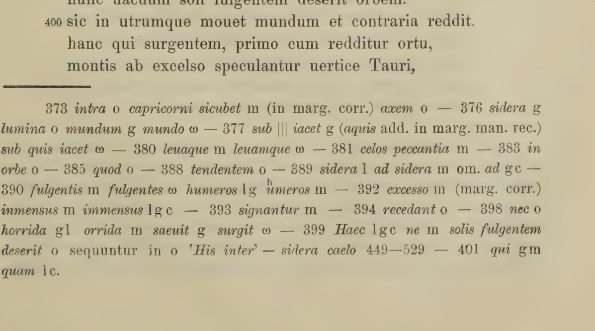
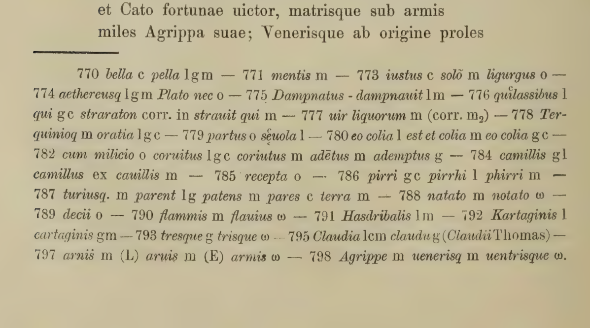
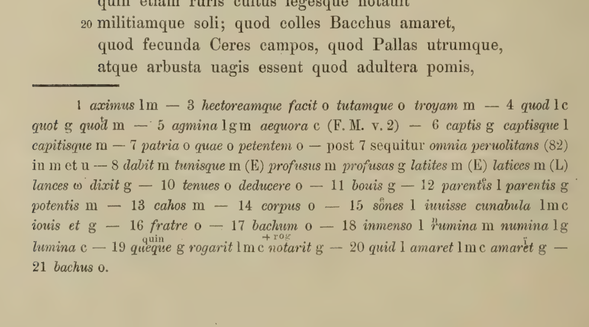
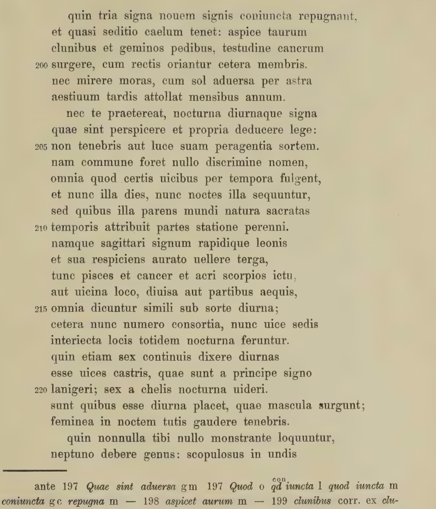
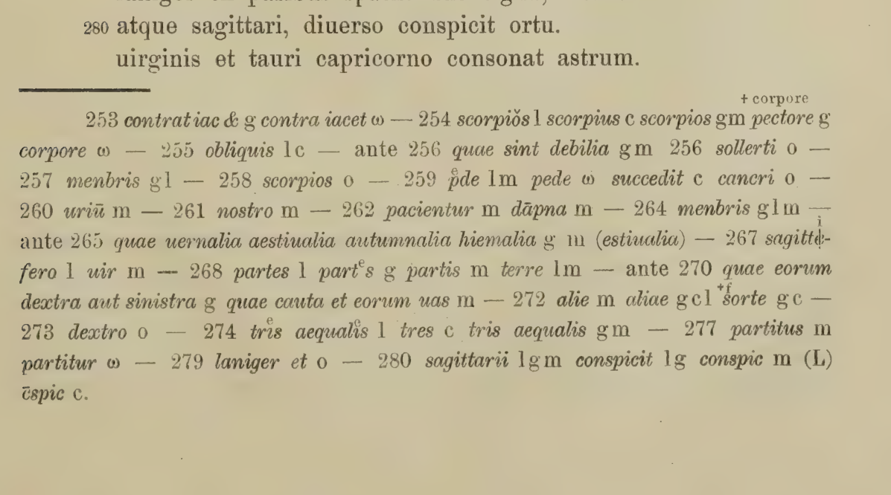
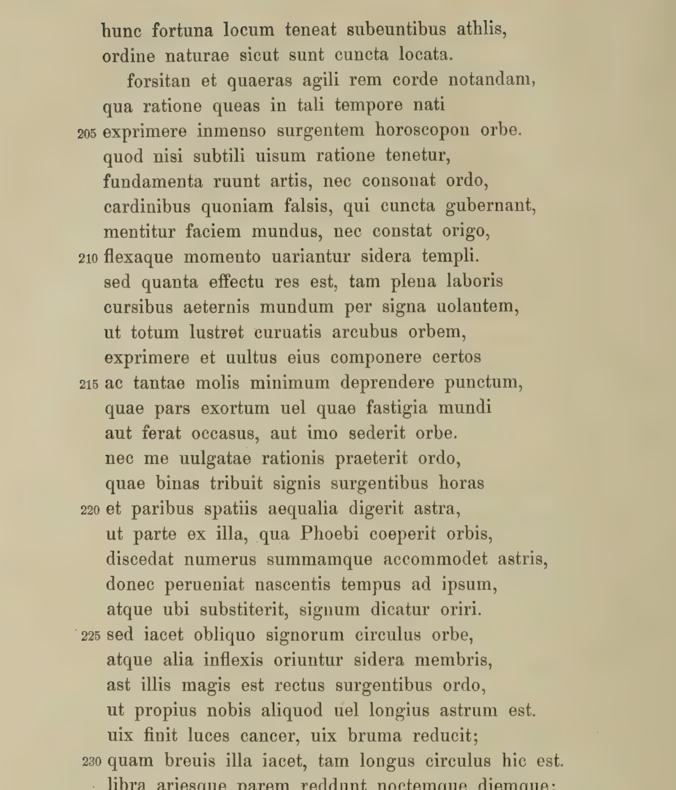
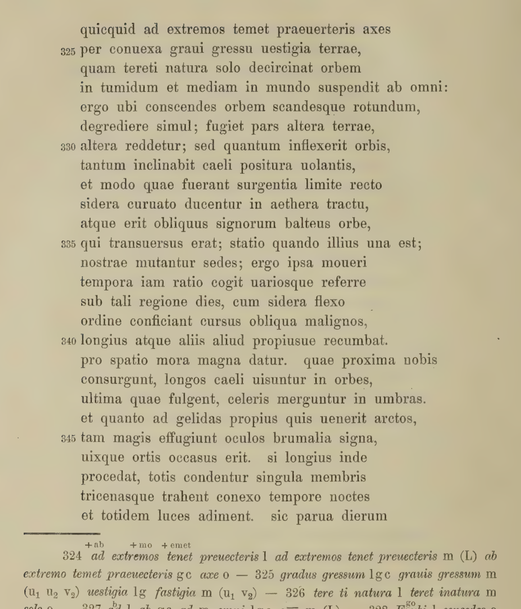

# Breiter 1907 정오표 적용 대조판

정오표 7항목의 적용 위치를 모두 대조했다. 세 항목은 시 본문에, 네 항목은 교감란에 적용한 별도 읽기 판이다. 관련 시구 128행을 한국어 25문단으로 직접 다시 옮겼으며 기존 다섯 권의 번역 분량에 중복 합산하지 않는다.

검토 대상은 Breiter 1907년판 자체의 정오표이다. 모든 판본·필사본의 이문을 교감하거나 오늘날의 합의를 확정한 작업이 아니다. 기존 인쇄 본문 보존판과 참고 자료는 그대로 둔다.

한국어 직접 번역·대조: ChatGPT (GPT-6 Astra Pro) · 2026-09-20

세 본문 교정: II.220 chelis → libra; III.217 ferat → terat; III.330 orbis → orbe. 나머지 네 교정은 시구가 아닌 교감란의 번호·독법·표제이다.

## E01. 행 번호의 교정: 373이 아니라 375

교감란의 참조 번호 · 인쇄본 13쪽 / PDF 29쪽

13쪽 끝에서 아홉째 줄, 교감란의 표제 번호 373을 375로 고친다. 시 본문 373행의 번호를 바꾸라는 지시가 아니다.

정오표: pag. 13 linea 9 a fine lege 375 pro 373.

교정 전: `373 intra o capricorni sicubet m (in marg. corr.) axem o`

교정 후: `375 intra o capricorni sicubet m (in marg. corr.) axem o`

잘못 붙은 표제 아래의 intra는 본문 375행 inter, capricorni는 같은 행의 염소자리, axem은 같은 행 끝의 axe와 대응한다. 따라서 이문 묶음이 가리키는 곳은 373행의 aspice가 아니라 375행이다.

o는 네 주요 사본의 합의, m은 마드리드 사본이다. 괄호는 여백의 교정을 가리킨다. 이문 sicubet를 의미가 매끄러운 본문으로 고치거나 아래 문장에 끼워 넣지 않는다. 원문 배열의 세부는 확대 지면에 보존한다.

### 문맥 대조 번역: 제1권 373–381행

**373–376행**

이제 태양의 운행로 아래에서 떠오르는 별들을 보라. 뜨겁게 탄 땅 위로 흘러가는 별들, 차가운 염소자리와 가장 아래의 축으로 받쳐진 천계 사이에서 도는 빛들을 보라.

<details><summary>라틴어 — 채택 본문 유지</summary>

```text
373 | aspice nunc infra solis surgentia cursus
374 | quae super exustas labuntur sidera terras,
375 | quaeque inter gelidum capricorni sidus et axe
376 | imo subnixum uertuntur lumina mundum,
```

</details>

**377–379행**

그 아래에는 우리가 닿을 수 없는 땅의 다른 부분과, 아직 모르는 민족들, 건너가 보지 못한 나라들이 있다. 그들 역시 하나의 태양에서 똑같은 빛을 받는다.

<details><summary>라틴어 — 채택 본문 유지</summary>

```text
377 | altera pars orbis sub quis iacet inuia nobis
378 | ignotaeque hominum gentes nec transita regna
379 | commune ex uno lumen ducentia sole
```

</details>

**380–381행**

그러나 그들이 보는 하늘은 방향이 뒤집혀 있으므로, 그림자는 우리와 반대로 드리워지고 사인들은 왼쪽으로 지며 오른쪽에서 떠오른다.

<details><summary>라틴어 — 채택 본문 유지</summary>

```text
380 | diuersasque umbras laeuaque cadentia signa
381 | et dextros ortus caelo spectantia uerso.
```

</details>

### 번역·편집 메모

이 문맥 번역의 라틴어 본문은 정오표로 달라지지 않는다. 교감란이 가리키는 행만 정정한다.

지역에 따라 뒤집혀 보이는 좌우는 시인의 지리적 관점이다. 모든 관측자의 고정 좌우 규칙이나 현대 지도 좌표로 바꾸지 않았다.



## E02. 사본의 독법을 고치는 정오: parent → parens

교감란의 사본 독법 · 인쇄본 26쪽 / PDF 42쪽

26쪽 끝에서 넷째 줄, 787행에 관한 교감란에서 l·g에 배정된 parent를 parens로 읽는다. 채택 본문의 pares를 parens로 바꾸는 정오는 아니다.

정오표: pag. 26 linea 4 a fine lege parens pro parent.

교정 전: `787 turiusq. m parent l g patens m pares c terra m`

교정 후: `787 turiusq. m parens l g patens m pares c terra m`

본문은 Fabricius Curiusque pares라고 인쇄되어 있으며, 파브리키우스와 쿠리우스를 나란히 견준다. 교감란의 c에는 pares가 있고, 그와 다른 l·g의 독법에 정오표가 적용된다.

parent·parens·patens·pares는 한 글자 차이라도 서로 다른 형태이다. 이문을 잘못 전사한 부분을 바로잡는 일과, 편집자가 채택한 본문을 다시 고르는 일은 구별해야 한다.

### 문맥 대조 번역: 제1권 784–791행

**784–786행**

유피테르에게서 하늘의 자리를 얻을 만한 공을 세우고 로마를 구하여 다시 세운 카밀루스가 있다. 왕에게서 되찾은 도시의 창건자 브루투스와, 피로스와의 전쟁에서 복수한 파피리우스도 있다.

<details><summary>라틴어 — 채택 본문 유지</summary>

```text
784 | et Ioue qui meruit caelum Romamque Camillus
785 | seruando posuit, Brutusque a rege receptae
786 | conditor, et Pyrrhi per bella Papirius ultor,
```

</details>

**787–788행**

서로 어깨를 나란히 하는 파브리키우스와 쿠리우스, 셋째 승리의 영광인 마르켈루스, 그리고 그보다 먼저 왕을 죽인 코수스가 있다.

<details><summary>라틴어 — 채택 본문 유지</summary>

```text
787 | Fabricius Curiusque pares et tertia palma
788 | Marcellus, Cossusque prior de rege necato,
```

</details>

**789–791행**

서원에서는 서로 겨루고 개선에서는 서로 닮은 데키우스 가문의 이들, 지연으로 꺾이지 않은 파비우스, 전쟁에서 네로를 동료로 삼아 하스드루발을 죽이고 승리한 리비우스도 있다.

<details><summary>라틴어 — 채택 본문 유지</summary>

```text
789 | certantesque Deci uotis similesque triumphis,
790 | inuictusque mora Fabius, uictorque necati
791 | Liuius Hasdrubalis socio per bella Nerone,
```

</details>

### 번역·편집 메모

pares는 두 인물을 동등하게 견주는 말로 옮겼다. 이 맥락 번역의 작은 어휘 다듬기는 parent→parens 정오의 적용 결과와 별개이다.

셋째 승리·서원·천상의 영예는 시인의 찬양을 옮긴 것이다. 각 인물의 역사적 경력을 새로 검증하거나 본문에 없는 사건을 덧붙이지 않았다.



## E03. Hectoreamque → Hectoreumque의 적용 위치

교감란의 사본 독법 · 인쇄본 32쪽 / PDF 48쪽

32쪽 끝에서 아홉째 줄, 제2권 3행에 딸린 교감란의 hectoreamque를 hectoreumque로 고친다. 정오표는 첫 글자를 대문자로 적었지만 적용 지면은 소문자이다.

정오표: pag. 32 linea 9 a fine lege Hectoreumque pro Hectoreamque.

교정 전: `3 hectoreamque facit o titamque o troyam m`

교정 후: `3 hectoreumque facit o titamque o troyam m`

저본의 채택 본문은 castra ducum et caeli uictamque sub Hectore Troiam이다. 교정되는 단어는 그 본문에 없고, o로 표시된 사본들의 독법에 나타난다. 그러므로 sub Hectore를 Hectoreumque로 바꾸면 안 된다.

-am-에서 -um-으로의 교정은 단순히 대소문자를 바꾸는 작업이 아니다. 정오 지시의 대문자 표기와 실제 적용 지면의 소문자 형태를 각각 보존했다. 다른 권의 비슷한 단어에 일괄 적용하지 않는다.

### 문맥 대조 번역: 제2권 1–17행

**1–11행**

가장 위대한 시인은 일리온 민족의 싸움, 쉰 왕과 그들의 왕이자 아버지, 장수들과 하늘 신들의 진영, 헥토르 아래에서도 패한 트로이를 성스러운 입으로 노래했다. 승리를 얻기까지 걸린 세월만큼 헤맨 지휘관과, 바다에서 두 무리 사이에 거듭된 전쟁, 마침내 고향의 빼앗긴 집에서 벌어진 싸움도 노래했다. 후대는 그 시인에게 고향의 권리를 주려 하면서 오히려 빼앗았다. 그의 입에서 쏟아진 물을 저마다의 노래로 이끌어, 한 사람의 풍요로 결실을 맺으며 큰 강을 가느다란 물줄기들로 나누려 했다. 그에 가장 가까이 뒤따르는 이는 헤시오도스이다.

<details><summary>라틴어 — 채택 본문 유지</summary>

```text
1 | Maximus Iliacae gentis certamina uates
2 | et quinquaginta regum regemque patremque
3 | castra ducum et caeli uictamque sub Hectore Troiam
4 | erroremque ducis totidem quot uicerat annis
5 | instantem bello geminata per agmina ponto
6 | ultimaque in patria captisque penatibus arma
7 | ore sacro cecinit; patriae cui iura petenti
8 | dum dabat eripuit, cuiusque ex ore profusos
9 | omnis posteritas latices in carmina duxit
10 | amnemque in tenuis ausa est diducere riuos
11 | unius fecunda bonis. sed proximus illi
```

</details>

**12–17행**

헤시오도스는 신들과 신들의 부모, 땅을 낳은 카오스와 그 아래의 어린 세계, 첫 운행에 비틀거리던 별들, 늙은 티탄들과 위대한 유피테르의 요람을 전한다. 오라비라는 이름 아래 남편이 된 이, 어머니 없이 부모가 된 이, 그리고 아버지의 몸에서 다시 태어나는 바쿠스도 전한다.

<details><summary>라틴어 — 채택 본문 유지</summary>

```text
12 | Hesiodus memorat diuos diuumque parentes
13 | et chaos enixum terras orbemque sub illo
14 | infantem et primos titubantia sidera cursus
15 | titanasque senes Iouis et cunabula magni
16 | et sub fratre uiri nomen sine matre parentis
17 | atque iterum patrio nascentem corpore Bacchum.
```

</details>

### 번역·편집 메모

이 구간의 시 본문에는 교정 대상어가 없으므로 라틴어 본문을 바꾸지 않은 채 새로 대조 번역했다.

11행 끝의 sed proximus illi는 다음의 Hesiodus와 이어진다. 한국어에서는 그 이름을 앞 문단의 끝에도 연결하여 문장을 완결했으나 라틴어 원문 행을 두 번 수록하지 않았다.

7~11행은 여러 후대가 시인을 자기 고향에 귀속시키는 주장을 물줄기의 비유와 잇는다. 16행의 신화적 관계는 압축되어 있어, 특정 인명을 본문에 보태거나 사본 이문을 채택 본문에 섞지 않았다.



## E04. 야간 사인의 출발점: chelis → libra

시 본문 · 인쇄본 39쪽 / PDF 55쪽

39쪽 처음부터 스물넷째 줄은 시 본문 제2권 220행이다. 여기서 chelis를 libra로 고쳐, 집게발이라는 이명 대신 천칭자리라는 명칭으로 읽는다.

정오표: pag. 39 linea 24 ab initio lege libra pro chelis.

교정 전: `lanigeri; sex a chelis nocturna uideri.`

교정 후: `lanigeri; sex a libra nocturna uideri.`

채택 본문의 이 한 단어를 정오표대로 교정한다. 교정 전 chelis 역시 기존 번역 메모에서 천칭자리의 시적 명칭으로 설명되어 있었으므로, 이번 교정을 이유로 사인 배정 자체가 달라졌다고 해서는 안 된다.

이 대목에는 주간·야간 사인을 나누는 세 가지 방식이 있다. 이번 수정은 두 번째 방식의 출발 명칭에만 적용된다. 첫 목록이나 세 번째의 남성·여성 사인 구분을 고치지 않는다.

### 문맥 대조 번역: 제2권 203–222행

**203–210행**

어떤 사인이 야간에 속하고 어떤 사인이 주간에 속하는지도, 그 고유한 법칙에 따라 살피고 구별하는 일을 잊지 말라. 어둠이나 빛 속에서 자기 몫을 수행한다는 뜻은 아니다. 그렇게 부르면 모두 같은 이름을 가져 구별이 없어질 것이기 때문이다. 모든 사인은 정해진 차례로 시간에 따라 빛나며, 때로는 낮이 때로는 밤이 그들을 뒤따른다. 여기서 말하는 것은 우주의 어머니인 자연이 변함없는 배정으로 각 사인에 주어 놓은 시간의 성스러운 몫이다.

<details><summary>라틴어 — 정오표 반영</summary>

```text
203 | nec te praetereat, nocturna diurnaque signa
204 | quae sint perspicere et propria deducere lege:
205 | non tenebris aut luce suam peragentia sortem.
206 | nam commune foret nullo discrimine nomen,
207 | omnia quod certis uicibus per tempora fulgent,
208 | et nunc illa dies, nunc noctes illa sequuntur,
209 | sed quibus illa parens mundi natura sacratas
210 | temporis attribuit partes statione perenni.
```

</details>

**211–217행**

활잡이의 사인과 날쌘 사자, 황금 양털을 걸치고 자기 등을 돌아보는 자, 이어 물고기와 게와 날카롭게 쏘는 전갈은 모두 같은 몫으로 주간 사인이라 불린다. 이들은 서로 이웃하거나 같은 간격으로 나뉘어 있다. 나머지는 같은 수로 짝을 이루거나 그 사이 자리에 번갈아 놓여, 역시 여섯 야간 사인이라 불린다.

<details><summary>라틴어 — 정오표 반영</summary>

```text
211 | namque sagittari signum rapidique leonis
212 | et sua respiciens aurato uellere terga,
213 | tunc pisces et cancer et acri scorpios ictu,
214 | aut uicina loco, diuisa aut partibus aequis,
215 | omnia dicuntur simili sub sorte diurna;
216 | cetera nunc numero consortia, nunc uice sedis
217 | interiecta locis totidem nocturna feruntur.
```

</details>

**218–220행**

또 어떤 이들은 첫 사인인 숫양부터 이어지는 여섯 자리에 주간의 차례가 있다고 말했다. 천칭자리부터 이어지는 여섯 자리는 야간에 속한다고 보았다.

<details><summary>라틴어 — 정오표 반영</summary>

```text
218 | quin etiam sex continuis dixere diurnas
219 | esse uices castris, quae sunt a principe signo
220 | lanigeri; sex a libra nocturna uideri.
```

</details>

**221–222행**

남성으로 떠오르는 사인들이 주간에 속한다고 여기는 이들도 있다. 여성 사인들은 밤으로 가서 그 안전한 어둠을 즐긴다는 것이다.

<details><summary>라틴어 — 정오표 반영</summary>

```text
221 | sunt quibus esse diurna placet, quae mascula surgunt;
222 | feminea in noctem tutis gaudere tenebris.
```

</details>

### 번역·편집 메모

새 대조판의 220행 한국어는 정오표의 명칭에 맞추어 천칭자리로 옮겼다. 인쇄 본문 보존판의 집게발이라는 표현과 그 옛 메모는 삭제하지 않는다.

첫 목록은 사수·사자·양·물고기·게·전갈이다. 다른 분류와 맞지 않는다는 이유로 순서나 성별을 바꾸지 않았다. 이 세 목록을 행성의 섹트 표와 합치지 않는다.



## E05. 삽입된 소제목의 약호: uas → d. a. s.

교감란의 소제목 · 인쇄본 41쪽 / PDF 57쪽

41쪽 끝에서 넷째 줄의 교감란, 270행 앞에 놓인 소제목의 마드리드 독법을 기록한 곳에서 uas를 d. a. s.로 고친다. 시구 270행 안의 단어를 바꾸는 지시가 아니다.

정오표: pag. 41 linea 4 a fine lege d. a. s. pro uas.

교정 전: `ante 270 quae eorum dextra aut sinistra g quae cauta et eorum uas m`

교정 후: `ante 270 quae eorum dextra aut sinistra g quae cauta et eorum d. a. s. m`

ante 270은 270행 앞이라는 위치 표지이다. g가 전하는 quae eorum dextra aut sinistra는 그 가운데 무엇이 오른쪽이고 왼쪽인가에 관한 표제이다. m의 기록에는 그 앞뒤로 다른 형태가 나타난다.

d. a. s.는 바로 앞의 dextra aut sinistra를 되풀이하는 약기일 가능성이 있지만, 정오표 자체는 세 글자를 풀어 쓰지 않는다. 이 대조판도 교정된 기호를 그대로 보존하고, 추정한 전체 문장을 사본의 실제 문구라고 만들지 않는다.

### 문맥 대조 번역: 제2권 270–278행

**270–272행**

사인들 각각의 고유한 형상을 아는 것만으로는 충분하지 않다. 그들은 서로 뜻을 맞추어 운명을 움직이기도 하고, 결속을 즐기며, 몫과 자리에서 서로 뒤를 잇기 때문이다.

<details><summary>라틴어 — 채택 본문 유지</summary>

```text
270 | nec satis est proprias signorum noscere formas;
271 | consensu quoque fata mouent et foedere gaudent
272 | atque aliis aliae succedunt sorte locoque.
```

</details>

**273–278행**

사인들의 굽은 원이 한 바퀴 닫혀 있을 때, 선은 같은 길이의 세 방향으로 뻗어 끝에서 끝으로 서로 이어진다. 그 선이 닿는 사인들을 삼각 관계라고 부른다. 세 갈래의 각이 세 사인에 놓이고, 각각의 사이에는 세 사인이 떨어져 있기 때문이다.

<details><summary>라틴어 — 채택 본문 유지</summary>

```text
273 | circulus ut flexo signorum clauditur orbe,
274 | in tris aequalis discurrit linea ductus
275 | inque uicem extremis iungit se finibus ipsa,
276 | et quaecumque ferit, dicuntur signa trigona,
277 | in tria partitus quod ter cadit angulus astra,
278 | quae diuisa manent ternis distantia signis.
```

</details>

### 번역·편집 메모

소제목은 시 본문보다 앞의 별도 전승 항목이다. 정오표가 보완한 약기를 새로운 시구로 추가하거나, 지금의 읽기 구간 제목을 고대 저자의 원래 장 제목이라고 표시하지 않는다.

사이의 세 사인이라는 포함·제외 방식과, 세 꼭짓점 사이의 실제 각도는 다른 층위이다. 앞선 번역처럼 사인 시작점 기준 120도와 그 사이에 놓인 세 사인을 구별한다.



## E06. 주요 자리를 지나가는 동사: ferat → terat

시 본문 · 인쇄본 72쪽 / PDF 88쪽

72쪽 처음부터 열일곱째 줄은 시 본문 제3권 217행이다. ferat를 terat로 고쳐, 운반하거나 가져온다는 말 대신 밟아 지나간다는 움직임으로 읽는다.

정오표: pag. 72 linea 17 ab initio lege terat pro ferat.

교정 전: `aut ferat occasus, aut imo sederit orbe.`

교정 후: `aut terat occasus, aut imo sederit orbe.`

terat는 tero의 형태이다. 이 문장에서는 exortum·fastigia·occasus라는 위치들과 연결하여 지나감의 뜻으로 읽었다. 고치기 전 번역이 이미 지는 자리에 이른다는 의미를 표현했더라도, 라틴어 대조문은 정오표의 실제 동사로 명확히 구별해야 한다.

이 정오가 뒤의 모든 상승 시간 계산을 새 방식으로 바꾸는 것은 아니다. 이어지는 두 시간당 한 사인 방식의 소개와 반박, 시간 단위가 달라진다는 논증은 함께 보존한다.

### 문맥 대조 번역: 제3권 203–246행

**203–205행**

그대는 민첩한 정신으로 살펴야 할 다른 문제도 물을 것이다. 태어나는 그 시각에 거대한 천구에서 떠오르는 호로스코포스를 어떤 방법으로 정확히 포착할 수 있는가?

<details><summary>라틴어 — 정오표 반영</summary>

```text
203 | forsitan et quaeras agili rem corde notandam,
204 | qua ratione queas in tali tempore nati
205 | exprimere inmenso surgentem horoscopon orbe.
```

</details>

**206–210행**

이것을 세밀한 이치로 파악하지 못하면 기술의 토대가 무너지고 순서도 서로 맞지 않는다. 모든 것을 다스리는 주요 자리가 잘못되면 천계는 거짓된 모습을 드러내고, 출발점이 서지 않으며, 장소가 조금만 기울어도 별들의 배치가 달라지기 때문이다.

<details><summary>라틴어 — 정오표 반영</summary>

```text
206 | quod nisi subtili uisum ratione tenetur,
207 | fundamenta ruunt artis, nec consonat ordo,
208 | cardinibus quoniam falsis, qui cuncta gubernant,
209 | mentitur faciem mundus, nec constat origo,
210 | flexaque momento uariantur sidera templi.
```

</details>

**211–217행**

그 결과가 중대한 만큼 이 일은 노고로 가득하다. 영원한 경로를 따라 사인들 사이를 날고 굽은 원호로 천구 전체를 도는 우주를 정확히 나타내며, 그 모습을 확실하게 세워야 한다. 그토록 거대한 구조 안의 가장 작은 점을 붙잡아, 어느 부분이 솟는 곳이나 하늘의 꼭대기나 지는 곳을 밟아 지나가고, 어느 부분이 맨 아래의 원에 자리하는지 알아내야 한다.

<details><summary>라틴어 — 정오표 반영</summary>

```text
211 | sed quanta effectu res est, tam plena laboris
212 | cursibus aeternis mundum per signa uolantem,
213 | ut totum lustret curuatis arcubus orbem,
214 | exprimere et uultus eius componere certos
215 | ac tantae molis minimum deprendere punctum,
216 | quae pars exortum uel quae fastigia mundi
217 | aut terat occasus, aut imo sederit orbe.
```

</details>

**218–224행**

나도 널리 쓰이는 계산의 순서를 모르지는 않는다. 그것은 떠오르는 사인마다 두 시간을 주고, 같은 크기의 사인들을 같은 시간 간격에 배정한다. 태양의 원반이 시작한 도수에서부터 수를 세어 각 사인에 합계를 맞추며 출생 시각에 이를 때까지 나아가고, 수가 멈춘 곳의 사인이 떠오른다고 말한다.

<details><summary>라틴어 — 정오표 반영</summary>

```text
218 | nec me uulgatae rationis praeterit ordo,
219 | quae binas tribuit signis surgentibus horas
220 | et paribus spatiis aequalia digerit astra,
221 | ut parte ex illa, qua Phoebi coeperit orbis,
222 | discedat numerus summamque accommodet astris,
223 | donec perueniat nascentis tempus ad ipsum,
224 | atque ubi substiterit, signum dicatur oriri.
```

</details>

**225–232행**

그러나 사인들의 원은 비스듬한 천구 위에 놓여 있다. 어떤 사인은 몸을 굽힌 채 떠오르고, 다른 사인은 더 곧은 순서로 떠오른다. 그 사인이 우리에게 더 가깝거나 더 멀리 있기 때문이다. 게자리가 낮을 끝내는 데는 오래 걸리고, 겨울이 낮을 되돌리는 데도 오래 걸린다. 이쪽의 원이 짧게 놓인 만큼 저쪽의 원은 길다. 천칭자리와 양자리는 밤과 낮을 같게 돌려주니, 가운데는 양끝과, 양끝은 꼭대기와 이렇게 서로 다르다.

<details><summary>라틴어 — 정오표 반영</summary>

```text
225 | sed iacet obliquo signorum circulus orbe,
226 | atque alia inflexis oriuntur sidera membris,
227 | ast illis magis est rectus surgentibus ordo,
228 | ut propius nobis aliquod uel longius astrum est.
229 | uix finit luces cancer, uix bruma reducit;
230 | quam breuis illa iacet, tam longus circulus hic est.
231 | libra ariesque parem reddunt noctemque diemque;
232 | sic media extremis pugnant extremaque summis.
```

</details>

**233–237행**

밤의 시간도 낮만큼이나 달라진다. 다만 서로 반대편의 달들에서는 같은 순서가 유지된다. 낮과 어둠의 길이와 크기가 그토록 다르다면, 모든 사인이 시간마다 같은 천계의 법칙 아래 머문다고 누가 믿을 수 있겠는가?

<details><summary>라틴어 — 정오표 반영</summary>

```text
233 | nec nocturna minus uariant quam tempora lucis,
234 | sed tantum aduersis idem stat mensibus ordo.
235 | in tam dissimili spatio uariisque dierum
236 | umbrarumque modis quis possit credere in horas
237 | omnia signa pari mundi sub lege manere?
```

</details>

**238–242행**

더구나 한 시간의 크기 자체도 일정하지 않다. 어떤 시간 뒤에든 같은 길이의 다른 시간이 따라오는 것은 아니다. 낮 전체의 길이가 바뀌듯 그 부분들도 늘어났다가 다시 줄어든다. 그렇지만 어느 사인에서 낮이 진행되든, 사인 여섯은 땅 위에 있고 다른 여섯은 그 아래에 있다.

<details><summary>라틴어 — 정오표 반영</summary>

```text
238 | adde quod incerta est horae mensura, neque ullam
239 | altera par sequitur, sed sicut summa dierum
240 | uertitur, et partes surgunt rursusque recedunt;
241 | cum tamen in quocumque dies deducitur astro,
242 | sex habeat supra terras, sex signa sub illis;
```

</details>

**243–246행**

따라서 모든 사인이 두 시간씩에 떠오를 수는 없다. 서로 어긋나는 시간들 안에는 그만큼의 여지가 없기 때문이다. 어느 낮에나 스물네 시간을 유지하려 한다 해도, 계산이 요구하는 그 수를 실제 적용에서는 받아들일 수 없다.

<details><summary>라틴어 — 정오표 반영</summary>

```text
243 | quo fit, ut in binas non possint omnia nasci,
244 | cum spatium non sit tantum pugnantibus horis,
245 | si modo bis senae seruantur luce sub omni.
246 | quem numerum debet ratio, sed non capit usus.
```

</details>

### 번역·편집 메모

새 번역은 217행의 terat를 밟아 지나간다는 동작으로 드러냈다. 인쇄 본문의 ferat와 정오표를 반영한 terat를 같은 전사 해시로 기록하지 않는다.

238~246행은 낮이나 밤을 나누는 시간의 길이를 논한다. 고정된 60분을 미리 대입해 모든 문장을 정상적인 현대 계산으로 다시 쓰지 않았다. 특히 245행의 luce와 bis senae 사이의 수량상 긴장은 원문에 남아 있다.

게자리와 겨울의 원, 가운데와 양끝이라는 비유의 대조는 저본의 서술이다. 현대 천구 좌표를 새로 계산하거나 모호한 대상을 특정한 물리적 양으로 확정하지 않았다.



## E07. 곡면을 따라 기울어짐: orbis → orbe

시 본문 · 인쇄본 76쪽 / PDF 92쪽

76쪽 처음부터 일곱째 줄은 시 본문 제3권 330행이다. orbis를 orbe로 고쳐 읽는다. 표제의 다른 orbis나 같은 쪽의 모든 orbe를 일괄 치환하지 않는다.

정오표: pag. 76 linea 7 ab initio lege orbe pro orbis.

교정 전: `altera reddetur; sed quantum inflexerit orbis,`

교정 후: `altera reddetur; sed quantum inflexerit orbe,`

정오 후의 orbe는 orbis의 탈격형이다. 따라서 땅의 구체 자체를 주어처럼 확정한 기존 한국어의 연결을 그대로 기계적으로 유지하지 않고, 구면을 따라 굽어 나간다는 관계로 다시 옮겼다.

정오표는 이 한 단어의 형태만 고친다. inflexerit의 생략된 주체나 고대 천구 모델의 모든 세부를 그 지시만으로 확정할 수는 없다. 새 번역도 원문에 없는 관측자의 실명이나 수량을 덧붙이지 않는다.

### 문맥 대조 번역: 제3권 323–343행

**323–327행**

그러나 그 땅의 지역을 벗어나, 지구의 둥근 지면을 무거운 걸음으로 밟으며 어느 쪽 끝의 극을 향해 나아간다고 하자. 자연은 지면을 둥글게 부푼 구체로 그려 놓고, 우주 전체의 한가운데에 떠 있도록 두었다.

<details><summary>라틴어 — 정오표 반영</summary>

```text
323 | at simul ex illa terrarum parte recedas,
324 | quicquid ad extremos temet praeuerteris axes
325 | per conuexa graui gressu uestigia terrae,
326 | quam tereti natura solo decircinat orbem
327 | in tumidum et mediam in mundo suspendit ab omni:
```

</details>

**328–335행**

그러므로 둥근 땅에 올라 그 곡면을 오를 때에는 동시에 내려가기도 할 것이다. 땅의 한 부분은 시야에서 물러나고 다른 부분은 다시 나타날 것이다. 구면을 따라 휘어 나간 만큼, 움직이는 하늘의 배치도 기울어진다. 조금 전까지 곧은 경계에서 떠오르던 사인들은 굽은 길을 따라 높은 하늘로 나아가고, 가로놓여 있던 사인들의 띠는 천구에서 비스듬해진다. 그 띠 자체가 자리하는 방식은 하나로 유지되기 때문이다.

<details><summary>라틴어 — 정오표 반영</summary>

```text
328 | ergo ubi conscendes orbem scandesque rotundum,
329 | degrediere simul; fugiet pars altera terrae,
330 | altera reddetur; sed quantum inflexerit orbe,
331 | tantum inclinabit caeli positura uolantis,
332 | et modo quae fuerant surgentia limite recto
333 | sidera curuato ducentur in aethera tractu,
334 | atque erit obliquus signorum balteus orbe,
335 | qui transuersus erat; statio quando illius una est;
```

</details>

**336–343행**

달라지는 것은 우리의 자리이다. 그러므로 이치상 시간 자체도 달라져, 그런 지역에서는 낮의 길이가 다르게 나타나야 한다. 사인들은 굽은 순서를 따라 비스듬히 제한된 경로를 마치고, 어떤 것은 더 멀리 어떤 것은 더 가까이 기울어진다. 경로가 길면 머무는 시간도 길다. 우리에게 더 가까이 떠오르는 것들은 하늘의 긴 원호를 따라 보이고, 가장 먼 곳에서 빛나는 것들은 빠르게 어둠 속으로 잠긴다.

<details><summary>라틴어 — 정오표 반영</summary>

```text
336 | nostrae mutantur sedes; ergo ipsa moueri
337 | tempora iam ratio cogit uariosque referre
338 | sub tali regione dies, cum sidera flexo
339 | ordine conficiant cursus obliqua malignos,
340 | longius atque aliis aliud propiusue recumbat.
341 | pro spatio mora magna datur. quae proxima nobis
342 | consurgunt, longos caeli uisuntur in orbes,
343 | ultima quae fulgent, celeris merguntur in umbras.
```

</details>

### 번역·편집 메모

새 대조판은 정오표의 orbe를 적용한다. 인쇄 본문 보존판의 orbis를 전사 오류라고 소급하여 지우지 않으며, 서로 다른 두 읽기와 한국어를 비교할 수 있게 남긴다.

323행은 PDF 91쪽의 마지막 본문 행이다. 324행부터 PDF 92쪽이 시작하므로 시작점과 정오 적용점의 쪽수를 구별한다.

332~343행의 관찰 위치·기울기·거리 표현은 저본의 논증을 직접 옮긴 것이다. 현대의 정밀 사승 산식이나 지구가 우주 중심이라는 과학적 입증으로 제시하지 않는다.


