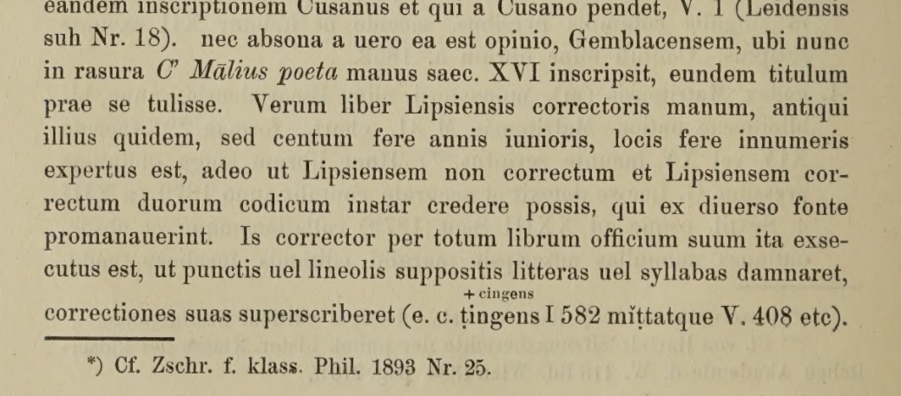
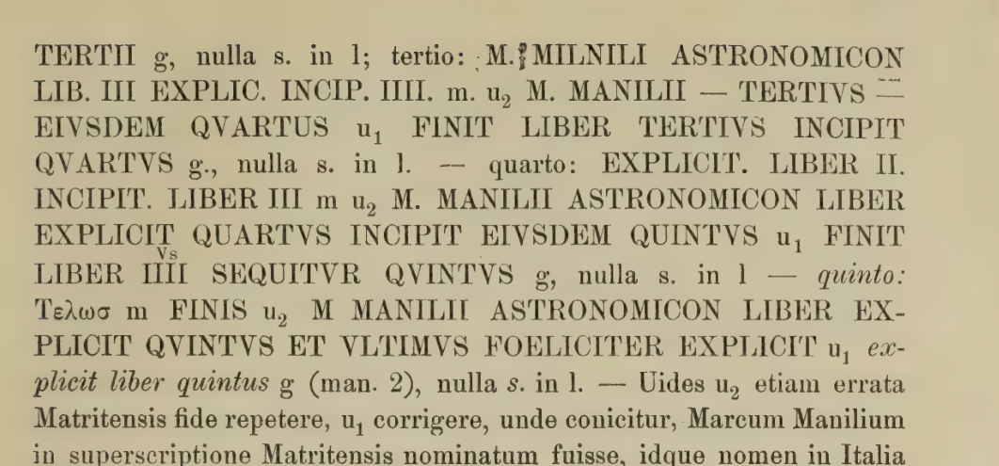
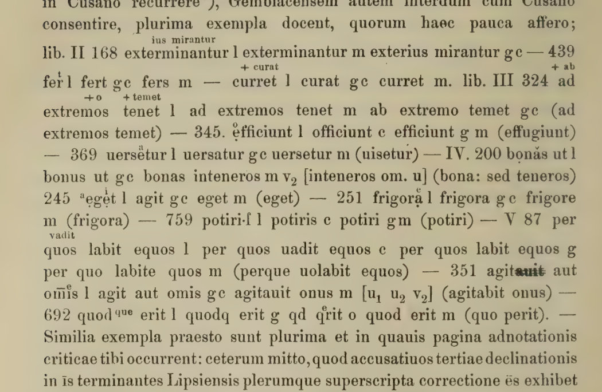
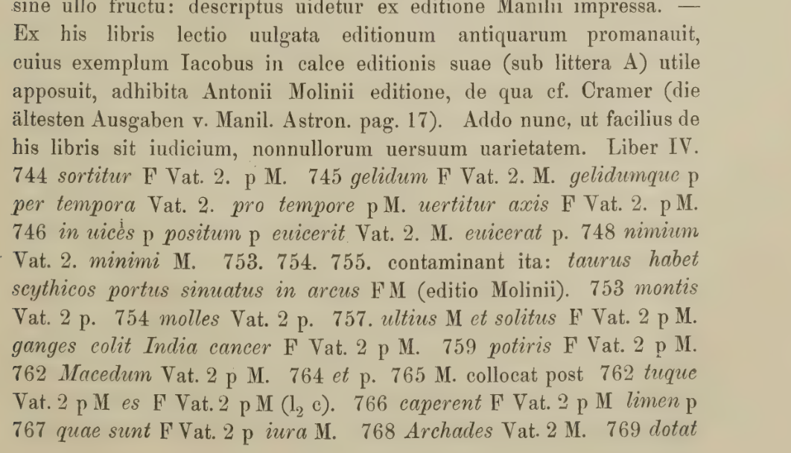
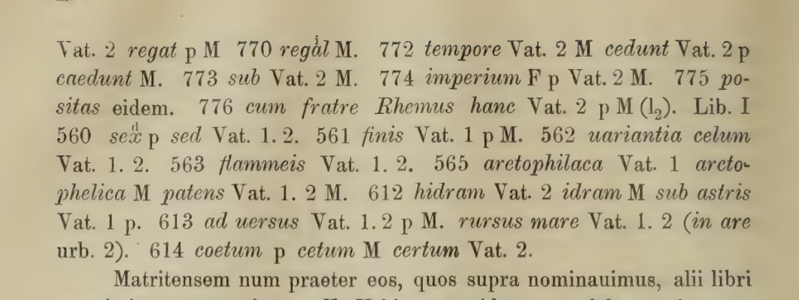
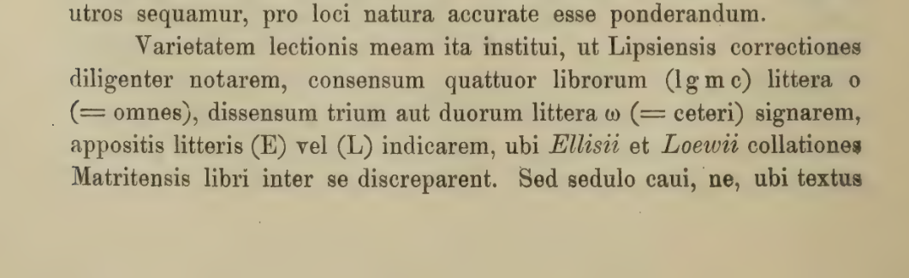
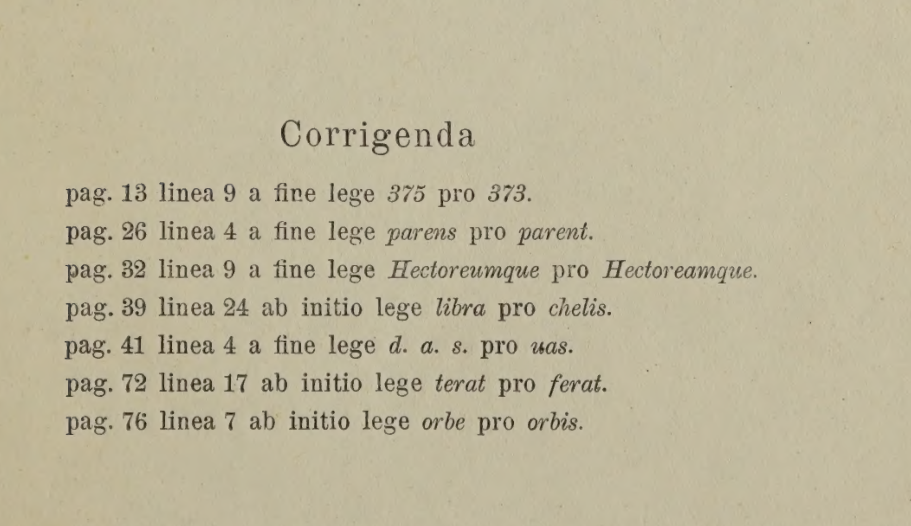

# Breiter 1907 편집자 서문·정오표 — 지면 대조 번역

저자: Theodor Breiter. 한국어 번역·대조: ChatGPT (GPT-6 Astra Pro). 2026-09-19.

서문 III–XI의 서술 산문·서지·인용문·각주를 직접 옮기고 정오표 7항목을 번역했다. 문법적으로 훼손된 이문 나열과 덧쓰기·삭제 위치는 영인 지면과 한국어 읽기 설명으로 제공한다. 모든 이문을 외교적으로 전사하거나 개별 오류 독법까지 의미 있는 시로 번역한 것은 아니다.

마닐리우스의 시 본문이 아니라 1907년 편집자의 논의이다. 원필사본의 실물 조사·현대 소장정보 확인·필사본 전수 교감을 수행하지 않았다. 앞서 제공한 요약을 서문 전체 번역으로 승격하지 않고 원본 지면에서 재작성·확장했다.

서문 III–XI / PDF 7–15쪽. 정오표는 PDF 5쪽. 시 본문 4,242행·695문단에 합산하지 않는다.

## 1. 비평 주석에 사용한 네 사본

인쇄본 III–IV · PDF 7–8쪽

나는 비평 주석에 네 사본의 독법을 기록했다. 그 사본들은 다음과 같다.

<details><summary>라틴어 대조</summary>

```text
Quattuor codicum lectiones in adnotatione critica notaui. Sunt autem hi:
```
</details>

1. 장블루 사본(g). 옛 장블루 수도원 소장본으로, 현재는 브뤼셀 왕립도서관에 있다(10012번). 양피지, 8절판 크기, 장수는 ‘IC’로 적혀 있으며, 대략 11세기에 필사된 것으로 보인다. 나는 이 사본을 두 차례, 1853년과 1892년에 직접 대조했다. P. 토마스도 이 사본을 논하고 정밀한 대조를 출판했다. 『마닐리우스 연구』, P. 토마스 저, 헨트, 1888년이다.

<details><summary>라틴어 대조</summary>

```text
1. Codex Gemblacensis (g), monasterii olim Gemblacensis, nunc Bruxellensis bibliothecae regiae (Nr. 10012), membr., formae 8º, IC schedis, saeculo ut uidetur XI perscriptus. De hoc libro, quem bis ipse (1853 et 1892) contuli, egit accuratamque collationem publicauit P. Thomas: ‘lucubrationes Manilianae. Scripsit P. Thomas. Gandi 1888.’
```
</details>

2. 라이프치히 사본(l). 파울리나 도서관 1465번이며 양피지로 되어 있다. 크기는 ‘큰 4절판 또는 작은 2절판’, 96장이고, 각 면에 23행을 적었다. 나는 이 사본이 쿠사누스보다 오래되며 장블루보다 연대가 뒤지지도 않는다고 판단했다. 제5권 끝의 기록에 따르면, ‘이 시인의 완비된 판본을 준비하던 저명한 리처드 벤틀리를 위해, 요아힘 프리드리히 펠러가 1693년 고테프리트 리히터와 협력하여’ 이 사본을 대조했다. 벤틀리판 서문을 보라. 이 대조본을 브레슬라우 대조본(Vrat.)이라고 부른다. 나는 1892년에 이 사본을 직접 대조했다.

<details><summary>라틴어 대조</summary>

```text
2. codex Lipsiensis (l) Nr. 1465 bibl. Paulinae, membr., formae ‘4 mai., uel 2. min.,’ continens folia 96. Versus uiceni terni in quauis pagina scripti sunt. Antiquiorem eum esse Cusano, non cedere aetate Gemblacensi mihi quidem persuasi. Contulit eum librum (uide subscriptionem in fine libri V) ‘in gratiam celeberrimi Viri Ricardi Bentlei parantis omnibus numeris absolutam huius poetae editionem Ioach. Frid. Fellerus Aº MDCXCIII socio adiuncto Gotefredo Richtero’ (uide praefationem editionis Bentleianae), quam collationem Vratislauiensem (Vrat.) uocant: ipse librum contuli a. 1892.
```
</details>

3. 쿠사누스 사본(c). 옛 쿠사누스 수도원 소장본으로, 현재 브뤼셀 왕립도서관에 있다(10699번). 양피지, 작은 2절판 크기이다. 17장에 작은 글씨로 두 단을 나누고 각 단에 70행씩 적었으며, 대략 12세기 말의 필사로 보인다. 나는 1853년에 이 사본을 대조했다.

<details><summary>라틴어 대조</summary>

```text
3. codex Cusanus (c), monasterii olim Cusani, nunc bibliothecae regiae Bruxellensis (Nr. 10699), membr., forma 2 min. Continet 17 folia, characteribus minutis binisque columnis, septuagenis in singulis columnis uersibus, saeculo ut uidetur XII exeunte scriptus. Contuli hunc librum a. 1853.
```
</details>

4. 마드리드 사본(m). 옛 에스코리알 수도원 소장본으로, 현재 마드리드 국립도서관 M 31이다. 종이, 2절판 크기이며, 14세기 또는 15세기 초에 필사되었다. 오랫동안 잊혔던 이 사본을 G. 뢰베가 발견하여 1879년 8월 13일부터 9월 23일까지 정밀하게 대조했고, 그 결과와 몇 가지 관찰을 야코프판 여백에 적었다. 이 책은 괴팅겐 도서관 Ms. phil. 139이다. 나는 도서관장의 호의로 1890년과 1892년에 그 대조 기록을 살펴볼 수 있었다. 이어 마닐리우스 연구에 크게 공헌한 로빈슨 엘리스가 1892년 마드리드에서 사본을 대조하고, 그 결과를 『클래시컬 리뷰』 제7·8권(1893·1894년)에 발표했다. 그는 1893년 『헤르마테나』 제19호에서도 이 사본을 자세히 논했다. 몇 곳에서는 뢰베와 엘리스가 서로 다르게 읽으므로 그 차이를 밝혀야 한다고 생각했다.

<details><summary>라틴어 대조</summary>

```text
4. codex Matritensis (m), monasterii olim Escorialensis, nunc bibliothecae nation. Matritensis M 31. chart., formae 2º, saeculo XIV uel XV ineunte scriptus. Hunc librum longa obliuione pressum G. Loewe detexit et accurate contulit anno 1879 (a XIII. d. Sextil. usque ad XXIII Sept. 1879) collationemque et obseruationes nonnullas adscripsit margini editionis Iacobeae (codd. Ms. phil. 139 bibliothecae Gottingensis), cuius collationis inspiciendae copia mihi facta est a. 1890 et 1892 benignitate directoris Gottingensis bibliothecae. Tum Rob. Ellis, uir de Manilianis studiis optime meritus, Matriti a. 1892 codicem contulit, collationemque suam (Voll. VII et VIII Classical Review a. 1893 et 1894) publici iuris fecit; idem iam a. 1893 de codice in Hermathen. Nr. XIX copiose disseruit. Aliquot locis Löwe et Ellis inter se discrepant, quod indicandum putaui.
```
</details>

### Breiter의 각주

**III *** 브레슬라우 왕립도서관에 보존되어 있으며, 스칼리게르판에 적어 넣은 대조 기록이다.

> asseruatur in Bibl. Reg. Vratisl., adscripta editioni Scaligeranae.

**III **** 폰 하르텔, 황립 학술원 철학·역사 분과 회의록 제113권, 빈, 1886년, 215쪽 이하를 참조하라.

> Cf. von Hartel: Sitzungsberichte der phil. histor. Klasse der kaiserlichen Akademie d. W, 113 Bd. Wien 1886, pag. 215ff.

**IV *** 『고전문헌학 잡지』 1893년 제25호를 참조하라.

> Cf. Zschr. f. klass. Phil. 1893 Nr. 25.

### 한국어 편집 메모

소장처·연대·크기·번호는 1907년 편집자의 서술이다. 오늘날의 소장정보로 갱신한 내용이 아니다. IC라는 장수 표기는 현대 숫자로 단정 변환하지 않았다.

앞서 제공한 요약형 초고의 ‘뷔트너’와 ‘1858년’은 지면에 맞지 않아 각각 Gotefredo Richtero와 1853년으로 바로잡았다. 필사본의 folium은 인쇄본 페이지와 구별한다.

## 2. 라이프치히 사본의 필사자·제목·교정자

인쇄본 IV–V · PDF 8–9쪽

그러나 이 사본들에 어느 정도의 권위를 부여할지 판단하려면, 라이프치히와 마드리드 사본에 관해 몇 가지를 덧붙일 필요가 있어 보인다. 라이프치히 사본에는 대략 세 필사자가 차례로 참여한 듯하다. 첫 번째 손은 처음부터 58장까지, 두 번째는 86장까지 나타나고, 이어 작은 글씨로 쓴 세 행이 나온 뒤 마지막에는 첫 번째 손이 다시 나타난다. 글자는 크고 약자는 적다.

<details><summary>라틴어 대조</summary>

```text
Verum ut quid his codicibus auctoritatis tribuendum sit, diiudicetur, addenda nonnulla de codicibus et Lipsiensi et Matritensi uidentur. In Lipsiensi scribendo tres fere scribae se excepisse uidentur (1. ab initio usque ad fol. 58, 2. ad fol. 86, tum sequuntur tres uersus litteris minutis scripti, ad extremum manus prima recurrit); litterae magnae, paucae abbreuiationes.
```
</details>

그러나 필사자들은 제목·소제목·첫머리 글자를 비워 둔 공간에 그려 넣는 장식 담당자들이 완성하도록, 그 부분의 작업을 남겨 두었다. 담당자들은 제1권의 제목을 언셜체로 넣고, 15장 606행 앞까지 마련된 자리에 소제목을 적었으며, 각 절의 첫머리 글자는 420행까지 덧붙였다. 665행과 805행에는 그 글자가 없다.

<details><summary>라틴어 대조</summary>

```text
Sed hi scribae opus imperfectum rubricatoribus absoluendum reliquerunt, qui titulum, lemmata, litteras initiales spatiis, quae uacua relicta erant, appingerent. Qui officio suo in libro primo ita satisfecerunt, ut titulum litteris uncialibus, lemmata spatiis destinatis usque ad fol. 15 ante vs. 606, initiales litteras singulis capitulis usque ad vs. 420 (desunt vs. 665, vs. 805) adderent.
```
</details>

야코프와 베헤르트는 ‘철학자 아라토스의 천문시 | 제1권 시작 | 서두’라는 제목이 다른 제목을 지워 낸 자리에 적혔다고 생각하며, 지워진 제목의 흔적까지 발견했다고 여긴다. 그러나 그것은 잘못이다. 실제로 어떤 글자들이 비쳐 보이고, 야코프의 말대로 읽기 어렵기는 하다. 베헤르트는 그 밑에 ‘astronomicon’이라는 글자가 있다고 생각했다. 하지만 실제로 비쳐 보이는 것은 21행, ‘두 겹의 열기에 둘러싸여 두 성소를 향해 기도한다’의 일부 글자들이다. 그 행은 첫 장 뒷면의 두 번째 행에 있으며, 뒤집힌 순서로 비쳐 보이기 때문에 더 읽기 어렵다.

<details><summary>라틴어 대조</summary>

```text
Titulum ARATI PHILOSOPHI ASTRONOMICON | LIB. PRIMVS INCIPIT | PRELIBATIO qui in rasura putant inscriptum esse expuncti alterius loco, cuius ipsa uestigia detexisse sibi uidentur, errant Iacobus et Bechertus: perlucent sane litterae quaedam, lectu, si Iacobum audimus, difficiles, quibus ‘astronomicon’ subesse Bechertus opinatus est. Perlucent enimuero litterae nonnullae uersus 21: ‘ad duo templa precor duplici circumdatus aestu’, qui uersus secundus est in folio 1v, sed perlucent inuerso ordine ideoque lectu sunt difficiliores.
```
</details>

쿠사누스와 그 사본에 의존하는 보시아누스 제1사본, 곧 레이던 18번에도 같은 제목이 있다. 지금은 지워 낸 자리에 16세기의 손이 ‘C’ Mālius poeta’라고 적어 놓은 장블루 사본 역시 원래 같은 제목을 지녔으리라는 견해는 사실에서 크게 벗어나지 않는다. 한편 라이프치히 사본은 거의 셀 수 없는 곳에서 교정자의 손을 거쳤다. 그 교정도 오래된 것이지만 원래 필사보다 약 백 년 뒤의 작업이다. 교정 전과 교정 후의 라이프치히 사본을 서로 다른 근원에서 나온 두 사본처럼 여길 수도 있을 정도이다.

<details><summary>라틴어 대조</summary>

```text
Habent autem eandem inscriptionem Cusanus et qui a Cusano pendet, V. 1 (Leidensis sub Nr. 18). nec absona a uero ea est opinio, Gemblacensem, ubi nunc in rasura C’ Mālius poeta manus saec. XVI inscripsit, eundem titulum prae se tulisse. Verum liber Lipsiensis correctoris manum, antiqui illius quidem, sed centum fere annis iunioris, locis fere innumeris expertus est, adeo ut Lipsiensem non correctum et Lipsiensem correctum duorum codicum instar credere possis, qui ex diuerso fonte promanauerint.
```
</details>

이 교정자는 책 전체에서 글자나 음절 아래에 점이나 짧은 선을 그어 그것을 배제하고, 위쪽에 자기 교정을 적었다. 예로 제1권 582행과 제5권 408행의 단어를 들 수 있다. 교정자는 약간 붉은 먹과 작고 둥근 글씨를 사용했다. 드물게는 15세기의 또 다른 손이 나타나 여백에 별 가치 없는 주석들을 적어 두었다.

<details><summary>라틴어 대조</summary>

```text
Is corrector per totum librum officium suum ita exsecutus est, ut punctis uel lineolis suppositis litteras uel syllabas damnaret, correctiones suas superscriberet (e. c. tingens I 582 mittatque V. 408 etc.). Ceterum atramento usus est subrubro, litteris minutis rotundioribus. Raro tertia quaedam manus saec. XV occurrit, quae scholia nullius pretii margini adscripsit.
```
</details>



PDF 8쪽: 지워 쓴 이름과 교정 표시 예시. 위·아래의 점·작은 글자·덧쓰기 위치는 이 지면으로 확인한다.

### 한국어 편집 메모

‘C’ Mālius poeta’의 약호·장음선은 인쇄된 시인명 표기를 보존한 것이며, 확인하지 않은 완전한 이름으로 풀어 쓰지 않았다. fol. 1v는 첫 장의 뒷면이다.

마지막 라틴어 대조문은 단어의 선형 형태를 보여 준다. I.582의 cingens 덧쓰기와 V.408의 글자 위아래 표시는 평면 문자열로 흉내 내지 않고 원본 확대 지면을 함께 제공한다.

아라토스라는 제목의 전승을 이 작품이 그리스어로 쓰였다는 증거로 사용하지 않는다. 본문 관찰과 ‘가치 없는’이라는 평가는 Breiter에게 귀속된다.

## 3. 마드리드 사본과 포조의 발견 기록

인쇄본 V–VI · PDF 9–10쪽

마드리드 사본의 위쪽 여백에는 뢰베에 따르면 17세기의 손으로 ‘마닐리우스의 천문시 — 스타티우스 파피니아누스의 『실바이』 — 키케로에 관한 아스코니우스 페디아누스 — 발레리우스 플라쿠스의 일부’라고 적혀 있다. 뒤의 말들은 짧은 선으로 지워져 있는데, 이는 아스코니우스와 발레리우스 플라쿠스도 한때 이 권책 안에 있었다는 증거이다. 두 작품은 현재 마드리드 국립도서관 X.81에 있다. 포조는 다른 작품들 외에 이 네 작품을 1417년 콘스탄츠에서 발견했다. 그는 마드리드 X.81의 마지막 94장 앞면에 자신의 손으로 다음과 같이 알려 준다.

<details><summary>라틴어 대조</summary>

```text
In superiore margine libri Matritensis a manu saec. XVII (Löwe) legitur: ‘Manilii Astronomicon — Statii Papiniani syluae — Asconius Pedianus in Ciceronem — Valerii Flacci nonnulla.’ Vltima uerba lineolis expuncta testantur, Asconium quoque et Valerium Flaccum hoc uolumine comprehensos fuisse, qui nunc Matrit. Nat. X. 81. continentur. Nempe hos quattuor (praeter alios) Poggius a. 1417 Constantiae inuenit, quod ipse in fine Matrit. X. 81 fol. 94r sua manu nos docuit:
```
</details>

‘이 운명이, 아미쿠스여, 이 손이 마침내 네 무모한 행위를 책망하였다.’ C. 발레리우스 플라쿠스의 『아르고나우티카』. 이 단편은 콘스탄츠에서 20마일 떨어진 성 갈루스 수도원에서 Q. 아스코니우스 페디아누스의 일부와 함께 발견되었다. 신께서 다른 이에게 두 작품을 모두 완전한 형태로 발견하게 허락하시기를. 우리는 할 수 있는 일을 했다. — 피렌체의 포조.

<details><summary>라틴어 대조</summary>

```text
hec sors hec amycu tandem manus arguit ausis. | C. ualeri flacci argonauticon. Hoc fragmentum repertum est in monasterio sancti galli prope constantiam. XX milib. passuum una cum parte Q asconii pediani. deus concedat alteri ut utrunque opus reperiat perfectum. Nos quod potuimus egimus. — Poggius florentinus.
```
</details>

G. 뢰베는 정확한 전사를 만들어 자신의 대조 기록, 곧 괴팅겐 도서관 Philol.139에 넣었다. 현재 마드리드 M.31은 114장이다. 1장 앞면부터 54장 뒷면까지 마닐리우스를 담고, 55장부터 63장 앞면까지는 비어 있다. 63장 뒷면에는 15세기의 손으로 ‘50장을 포함한다’고 적혀 있으며, 실제로 64–114장에는 스타티우스가 있다. 그러나 첫 장 앞면은 마닐리우스 제1권 83행, ‘날카로운 실천이 시도 끝에 발견한 것은 무엇이든’에서 시작한다. 제목과 1–82행을 담았던 한 장이 잘려 나갔기 때문이다.

<details><summary>라틴어 대조</summary>

```text
Descriptionem exactam G. Loewe fecit inseruitque collationi suae (cod. Philol. 139 biblioth. Gotting.). Nunc Ms. Matrit. M. 31 habet folia 114; quorum folia 1r–54v Manilium continent, folia 55–63r uacua sunt; f. 63v manu saec. XV legitur: ‘continet folia L’: nempe folia 64–114 Statium exhibent. Sed folium 1r incipit a uersu Manilii lib. I 83: ‘et quodcumque sagax temptando repperit usus’ — abscissum enim unum est folium cum titulo et uersibus 1–82.
```
</details>

G. 뢰베는 이 책이 포조가 콘스탄츠에서 발견한 바로 그 사본이라고 확신했고, 괴팅겐의 대조 기록 여러 곳에서 그 뜻을 밝혔다. 제4권 569행의 여백에는 ‘주의. l₁·V₂와 포조도 한 계통을 이루는 듯하다’고 적었다. 뢰베는 제1권 801행까지 15세기의 교정자 세 사람이 손댔다고 보고하며, 그 교정들을 M₂, 곧 두 번째 손이라는 표시로 나타냈다. 내가 잘못 이해하지 않았다면, 그는 책 자체는 15세기 이전에 쓰였다고 생각한 것이다.

<details><summary>라틴어 대조</summary>

```text
Hunc librum non esse diuersum ab eo codice, quem Poggius Constantiae inuenit, G. Loewe sibi persuaserat idque in collatione Gottingensi pluribus locis testatur (ad vs IV. 569 in margine: ‘NB. l₁ V₂ u. Poggio scheinen auch eine Familie zu bilden’). Qui cum tres manus emendatrices saeculi XV in libro primo usque ad vs 801 grassatas esse referat, quarum correctiones apposita nota M₂ (manus secunda) indicat, librum ipsum ante saeculum XV scriptum esse, ni fallor, arbitratus est.
```
</details>

엘리스·클라크·하우스먼은 그와 의견이 다르다. 엘리스는 『헤르마테나』 제19호 263쪽(1893년)에서, 거의 모든 곳에서 보시아누스 제2사본과 일치한다는 이유로 마드리드 사본을 전사본으로 본다. 다만 어느 것이 어느 것을 베꼈는지는 말하지 않는다. 클라크의 판단은 자신이 발견한 포조의 편지에 근거한다. 그 편지는 1417년 말이나 1418년 초 콘스탄츠에서 로마(?)의 프란체스코 바르바로에게 보내졌다. 그 일부를 여기에 붙인다.

<details><summary>라틴어 대조</summary>

```text
Dissentiunt ab eo Ellis, Clarkius, Housman. Et Ellis quidem (Hermathen. XIX. 263 1893), quia fere ubique conspiret cum Vossiano 2., Matritensem codicem apographon (uter ab utro descriptus sit, non dicit) esse censet. Sed Clarkii iudicium epistola Poggiana ab ipso detecta nititur, quae exeunte anno 1417 uel ineunte 1418 ad Franciscum Barbarum Romam (?) Constantia missa est, cuius partem appono:
```
</details>

### Breiter의 각주

**V *** 베를린 『고전문헌학 주보』 1893년 제35호를 참조하라.

> Cf. Wochenschr. f. klass. Philol. Berol. 1893. 35.

**V **** A. C. 클라크, 「포조의 문헌 발견」, 『클래시컬 리뷰』 제13권, 런던, 1899년, 저본에 적힌 위치 119–120을 참조하라.

> A. C. Clark, the litterary discoveries of Poggio — The Classical Review Vol. XIII. London 1899 n. 119–120.

### 한국어 편집 메모

포조 기록의 라틴어 약호는 읽기용으로 풀어 썼다. 첫 줄은 발레리우스 플라쿠스의 끝을 인용한 단편이며 arguit와 ausis의 압축된 연결을 ‘무모한 행위를 책망하다’로 옮겼다. 별도의 작품 전체나 그 비평판을 새로 대조한 번역은 아니다.

‘50장’이라는 기재와 64–114장이라는 수치가 달라도 저본의 말을 임의로 일치시키지 않았다. 사본 첫 82행의 부재를 작품 전체에서 그 시구들이 소실됐다는 뜻으로 확대하지 않는다.

날짜와 발견 장소·사본 동일성은 Breiter가 소개하는 기록 및 학자들의 견해이다. 실제 원필사본을 이번에 조사한 것은 아니다.

## 4. 포조의 편지와 마드리드 계통의 전사본

인쇄본 V–VI · PDF 9–10쪽

포조가 프란체스코 바르바로에게 인사한다. … 이제 나도 무엇인가 보답하기 시작하려고, 피사의 사제 브란디누스를 통해 … 실리우스 이탈리쿠스, 스타티우스의 『실바이』 다섯 권, 그리고 M. 마닐리우스의 천문시를 그대에게 보낸다. 이 책들을 베낀 사람은 살아 있는 모든 이 가운데 가장 무지했다. 읽는 것이 아니라 점을 쳐서 알아내야 할 정도이므로, 학식 있는 사람이 다시 베껴야 한다.

<details><summary>라틴어 대조</summary>

```text
Poggius P. S. D. Francisco Barbaro — — utque aliquid incipiam referre, mitto ad te per presbyterum Brandinum Pisanum — — Silium Italicum, libros V. Statii Siluarum, item M. Manilium Astronomicum. Is qui libros transcripsit, ignorantissimus omnium uiuentium fuit, diuinare oportet non legere, itaque opus est ut transscribantur per hominem doctum.
```
</details>

나는 실리우스를 제13권까지 읽으며 많은 곳을 고쳤다. 제대로 필사하는 사람이라면 나머지 책들에서도 같은 종류의 오류를 쉽게 알아보고 바로잡을 수 있을 것이다. 그러니 이 책들을 다시 베끼도록 힘쓰고, 그 뒤 피렌체의 니콜라우스에게 보내 주기 바란다. 연설문들의 사본은 여기에 남겨 두고 싶다. …

<details><summary>라틴어 대조</summary>

```text
Ego legi usque ad XIII librum Silii, multa emendaui, ita ut recte scribenti facile sit similes errores deprehendere eosque corrigere in reliquis libris, itaque da operam ut transscribantur, postea mittas illos Florentiam ad Nicolaum. Orationum uolo hic exemplar remanere. — — —
```
</details>

그는 여기서 다음과 같이 추론한다. 원사본 자체가 이탈리아로 온 것 같지는 않다. 그 흔적조차 남아 있지 않기 때문이다. 오히려 포조가 콘스탄츠에서 전사본을 만들었거나, 이탈리아식과 다른 필체를 쓰는 스위스 필사자에게 만들게 했다는 것이다. 엘리스는 그 글씨가 ‘어느 정도 고딕식’이라고 한다. 하우스먼은 ‘마드리드 책은 학식 있는 사람이 만든 전사본’이라고 말한다.

<details><summary>라틴어 대조</summary>

```text
Hinc ita argumentatur: non uideri ipsum codicem in Italiam uenisse, quoniam eius ne uestigiam quidem habeamus; sed Poggium Constantiae fecisse apographon uel faciendum curasse per scribam Helueticum, cuius litterae ab Italico charactere discrepent (Ellis: ‘the writing-somewhat in the Gothic style’). Housman: ‘est Matrit. liber transcriptio facta per hominem doctum’.
```
</details>

하지만 당시 공적인 일로 몹시 바빴던 사람이 서둘러 쓴 이 편지만으로, 포조가 프란체스코 바르바로에게 다시 베끼라고 보낸 것이 스타티우스와 마닐리우스의 사본 자체였는지, 아니면 어디서 누가 만들었는지 모를 그 전사본들이었는지를 판정할 수 있다면, 그는 내게 위대한 아폴론일 것이다. 그러나 점을 칠 필요는 없다. 마드리드 사본에서 매우 충실하게 베껴 쓴 책들이 실제로 남아 있기 때문이다.

<details><summary>라틴어 대조</summary>

```text
Sed ex hac epistola, properanter ut ab homine tunc negotiis publicis occupatissimo scripta, qui diiudicare possit, utrum etiam Statii et Manilii codices ipsos an apographa eorum nescio ubi et a quibus facta Poggius ad Franciscum Barbarum transcribenda miserit, is mihi magnus erit Apollo. Neque opus est diuinatione: extant enim exemplaria a codice Matritensi fidissime descripta:
```
</details>

첫째는 우르비노 668번(802), 둘째는 667번(803)이다. 둘 다 바티칸 도서관에 있고, 15세기의 이탈리아식 글씨로 아름답게 필사되었다. 여기에 셋째로 레이던 보시아누스 제2사본(390번)의 뒷부분, 곧 제2권 692행 이후를 더한다. 앞부분은 보시아누스 제1사본과 일치한다. 야코프의 말대로 ‘아주 작은 오류까지 놀라울 만큼 같아서, 하나가 다른 하나를 베꼈다고 생각할 정도’이다. 이 뒷부분이 마드리드와 일치한다는 것은 엘리스가 『헤르마테나』 같은 곳 265–270쪽에서 밝혔다. 나는 두 우르비노 사본에 관해 같은 점을 설명했다(『고전문헌학 주보』 1904년 제24호). 베헤르트의 『마닐리우스 교정 방법』 19쪽을 따라 668번(802)은 u₁, 667번(803)은 u₂로 표시했다. 이 네 사본은 나머지와 구별되는 하나의 계통을 이룬다.

<details><summary>라틴어 대조</summary>

```text
1) cod. Urbinas Nr. 668 (802), 2) cod. Urbinas Nr. 667 (803), uterque in bibliotheca Vaticana, italicis characteribus saec. XV pulchre scriptus: quibus tertio loco adiungimus Vossiani 2 Leidensis (Nr. 390) alteram partem a uersu 692 libri secundi (nam prior pars ita consentit cum Vossiano I — miro quodam modo in minimis etiam erratis, ut alterum ab altero descriptum putes’ Iacob.). Huius cum Matrit. consensum illustrauit Ellis (Hermathen. l. l. 265–270): idem ego de Urbinate utroque exposui (W. f. cl. Phil. 1904 Nr. 24). Urbinatem 668 (802) littera u₁, Urbinatem 667 (803) littera u₂ Bechertum d. Manil. Em. rat. pag. 19 secutus notaui. Hi quattuor libri unam et a ceteris distantem familiam efficiunt.
```
</details>

### Breiter의 각주

**VI *** 베네치아 사본에는 ‘그대에게 … 그 사제가’ 또는 ‘그 사제가 그대에게 …’라는 어순의 표현이 있다.

> in cod. Venet.: ‘is Presbyter qui tibi’ — uel: ‘qui Presbyter tibi’.

### 한국어 편집 메모

편지의 …는 Breiter가 인용을 생략한 표지를 반영한다. 포조의 편지 전체를 번역했다는 뜻이 아니라 이 서문이 인용한 범위 전체를 옮긴 것이다.

서문의 라틴어 안에 들어 있는 엘리스의 짧은 영어 인용도 해당 위치에서 번역했다. 마닐리우스 영어역을 중역한 것이 아니다. vestigiam 등의 저본 인쇄 형태는 의미를 해치지 않는 범위에서 그대로 남겼다.

u₁=668(802), u₂=667(803)이다. 기호의 아래첨자를 1·2라는 독립 행 번호나 사본 수로 오해하지 않도록 한다.

## 5. 권말·권두 표기가 전하는 이름과 오류

인쇄본 VI–VII · PDF 10–11쪽

제목과 권말 기록에 관해 몇 가지를 제시해야 한다. 제1권 끝에는 m·u₁·u₂가 ‘M. 마닐리우스의 천문시. 제1권 끝. 제2권 시작’이라고 적는다. g도 ‘제1권 끝, 제2권 시작’이라는 뜻의 약기(SCDS)를 적는다. l과 c에는 권말 기록이 없다.

<details><summary>라틴어 대조</summary>

```text
Pauca de inscriptionibus et subscriptionibus offerenda sunt. Primo libro subscribunt: M. MANILII. ASTRONOMICON. LIBER. PRIMUS. EXPLICIT. INCIPIT. SECUNDUS m u₁ u₂; EXPLICIT LIBER PRIMUS INCIPIT SCDS g, nulla subscriptio in l et c.
```
</details>

제2권에서는 m·u₂가 ‘MANILII BOENI ASTRONOMICON’, u₁은 ‘MANLII BOEUI’라고 전한다. g에는 ‘제2권 끝, 제3권의 서문’이라는 뜻의 기록이 있으며 PRAETATIO라는 철자가 쓰였다. l에는 기록이 없다.

<details><summary>라틴어 대조</summary>

```text
secundo libro: MANILII BOENI ASTRONOMICON m u₂; MANLII BOEUI u₁; EXPLIC. LIBER SECVNDVS PRAETATIO LIBRI TERTII g, nulla s. in l.
```
</details>

제3권에서는 m·u₂가 ‘M. MILNILI의 천문시, 제3권 끝, 제4권 시작’이라고 적는다. u₁에서는 이름이 M. MANILII이고, 제3권에서 같은 저자의 제4권으로 넘어간다. g는 ‘제3권 끝, 제4권 시작’이라고 적고 l에는 기록이 없다.

<details><summary>라틴어 대조</summary>

```text
tertio: M. MILNILI ASTRONOMICON LIB. III EXPLIC. INCIP. IIII. m u₂; M. MANILII — TERTIVS — EIVSDEM QVARTUS u₁; FINIT LIBER TERTIVS INCIPIT QVARTVS g., nulla s. in l.
```
</details>

제4권의 끝인데도 m·u₂에는 ‘제2권 끝, 제3권 시작’이라고 적혀 있다. u₁에는 ‘M. 마닐리우스의 천문시 제4권 끝, 같은 저자의 제5권 시작’이라고 적는다. g도 제4권이 끝나고 제5권이 이어진다고 적으며 l에는 기록이 없다.

<details><summary>라틴어 대조</summary>

```text
quarto: EXPLICIT. LIBER II. INCIPIT. LIBER III m u₂; M. MANILII ASTRONOMICON LIBER EXPLICIT QVARTVS INCIPIT EIVSDEM QVINTVS u₁; FINIT LIBER IIII SEQVITVR QVINTVS g, nulla s. in l.
```
</details>

제5권 끝에는 m이 그리스어 ‘Τέλωσ’, u₂가 라틴어 ‘FINIS’로 끝임을 표시한다. u₁은 ‘M. 마닐리우스의 천문시, 다섯째이자 마지막 권이 끝난다. 무사히 끝난다’고 적는다. g에는 두 번째 손이 ‘제5권 끝’이라고 적었으며 l에는 기록이 없다.

<details><summary>라틴어 대조</summary>

```text
quinto: Τέλωσ m; FINIS u₂; M MANILII ASTRONOMICON LIBER EXPLICIT QVINTVS ET VLTIMVS FOELICITER EXPLICIT u₁; explicit liber quintus g (man. 2), nulla s. in l.
```
</details>

u₂는 마드리드의 오류까지 충실하게 되풀이하고, u₁은 이를 고치는 것을 볼 수 있다. 여기에서 마드리드 사본의 머리 제목에도 마르쿠스 마닐리우스라는 이름이 있었으며, 이 이름이 이탈리아에서 게르베르 시대부터 쓰였다고 추정할 수 있다.

<details><summary>라틴어 대조</summary>

```text
Vides u₂ etiam errata Matritensis fide repetere, u₁ corrigere, unde coniicitur, Marcum Manilium in superscriptione Matritensis nominatum fuisse, idque nomen in Italia iam inde a Gerberti aetate usurpatum esse.
```
</details>



PDF 11쪽의 권말 표기. 잘못된 이름·권 번호·첨자·철자는 본문 저자의 문장이 아니라 사본의 기록이다.

### 한국어 편집 메모

라틴어란의 세미콜론은 사본별 대응을 읽기 쉽게 분리한 편집상의 구분이다. 지면의 모든 간격·장식·윗글자까지 외교적으로 재현하는 전사는 아니다. 복잡한 원표기는 확대 지면에 함께 남겼다.

제4권 끝의 II→III라는 잘못된 권 번호, MILNILI·BOENI·BOEUI·PRAETATIO 및 Τέλωσ 등의 비표준 철자를 정상적인 제목으로 조용히 교체하지 않았다. 그 오류 자체가 Breiter의 계통 추론 근거이다.

## 6. 소제목이 시구로 바뀌는 전승의 사례

인쇄본 VII · PDF 11–11쪽

사본들 사이의 친연 관계를 판단하려는 사람은 소제목이나 절 제목도 소홀히 하지 않을 것이다. 장블루·쿠사누스·마드리드 사본에서는 오래된 소제목들을 첫 번째 손이 언셜체로 본문에 넣었다. 라이프치히 제1권도 마찬가지지만 붉은 소문자체를 썼다. 뒤의 권들에서는 제목을 넣을 공간만 비워 두었고, 제목 자체는 두 번째 손이 여백에 적었다.

<details><summary>라틴어 대조</summary>

```text
Nec lemmata siue capitula is negliget qui de adfinitate codicum inter se iudicare uolet. In libris Gemblacensi, Cusano, Matritensi lemmata antiqua a prima manu textui litteris uncialibus inscripta sunt, idemque in primo Lipsiensis libro, sed litteris minusculis rub. factum. In sequentibus libris spatia capitulis inscribendis uacua relicta, ipsa capitula a manu 2. margini adscripta sunt.
```
</details>

그런데 같은 라이프치히 사본은 제1권 끝에 제2권의 모든 절 제목을 첫머리 글자 없이 소문자체로 열다섯 줄에 연달아 적었다. c·m·u₁·u₂도 첫머리 글자를 더한 것만 다를 뿐 이를 따르므로, 더 오래된 사본을 베낀 것으로 보인다.

<details><summary>라틴어 대조</summary>

```text
Sed idem Lipsiensis in fine libri primi omnia capitula, quae ad librum secundum pertinent, continua serie quindecim lineis, litteris minusculis, omissis initialibus exhibet, eumque sed additis initialibus sequuntur c, m, u₁, u₂, adeo ut uetustiorem codicem descripsisse uideantur.
```
</details>

그 결과 다음과 같은 일이 생겼다. 라이프치히는 소제목이 전혀 필요 없는 제2권 902행 뒤에 한 줄의 공간을 남겼다. 그러자 m·u₁·u₂·v₂는 맥락과 연결되지 않는 잘못된 반쪽 시구 ‘그토록 큰 죽음의 위험들을 거쳐’(PER TANTA PERICVLA MORTIS)를 소제목처럼 적어 넣었다.

<details><summary>라틴어 대조</summary>

```text
Ita factum est, ut cum Lipsiensis post uersum 902 lib. II spatium unius lineae reliquisset, ubi capitulo res minime indigebat, m, u₁, u₂ v₂ uersum dimidiatum erroneum PER TANTA PERICVLA MORTIS nexu carentem lemmatis instar inscriberent.
```
</details>

제1권 561행 앞, 몇 장의 위치가 바뀐 곳에서 m·u₁·u₂는 ‘하늘의 원들, 콜루르에 관하여’라는 소제목을 전한다. l의 본문에는 ‘콜루르에 관하여’, g·c의 여백에도 같은 말이 있다. 이제 콜루르를 논해야 한다고 생각한 첫 번째 삽입자는 l·g·c에서 다음 시구를 만들어 냈다. ‘용의 등을 거쳐 아르크토필락스를 향해 통과한다.’ 여기에 두 번째 삽입자(m·u₁·u₂)는 ‘천칭의 시작을 건드리고 꼭대기로 되돌아가며, 하늘 꼭대기에서 여섯 완전한 도수를 떠난다’는 구절을 더했다.

<details><summary>라틴어 대조</summary>

```text
In primo libro ante 561, ubi folia nonnulla locum mutauerunt, lemma exhibent m u₁ u₂: De circulis celestibus de coluris, l in textu De coluris, idem in margine g c. Qui iam de coluris agendum putabat, interpolator primus in l g c uersum excussit hunc: permeat artophilaca petens per terga draconis, cui interpolator secundus (m u₁ u₂) addidit: tangit et originem chelarum summaque regredit sexque fugit solidas celi uertice partes.
```
</details>

제3권 160행에서도 비슷한 오류가 생겼다. l이 소제목을 넣으려고 한 줄 비워 둔 곳을 m·u₁·u₂·v₂는 소문자체로 한 시구처럼 채웠다. 그 안의 ‘Quomodo ad aper signa de sonibus ammri’라는 훼손된 표현은 정상적인 뜻으로 읽히지 않으며, v₂에서는 ad apet라고 한다. 덧붙은 표지는 m의 원래 소제목이 ‘아틀라가 사인들에 어떻게 배치되는가’였음을 보여 준다. c와 l도 이를 여백에 전한다.

<details><summary>라틴어 대조</summary>

```text
Similiter erratum est III 160. Ibi spatium unius lineae lemmati inscribendo in l. relictum ita expleuerunt m u₁ u₂ v₂, ut uersus instar litteris minusculis inscriberent: ‘Quomodo ad aper signa de sonibus ammri; (ad apet v₂); additum signum’; in m docet lemma olim fuisse: Quom athla per signa describantur (c. et l in marg.).
```
</details>

### 한국어 편집 메모

완전한 라틴어 문장이 아닌 오류 독법도 증거로 보존한다. 억지로 자연스러운 한국어 시구를 만들어 주지 않는다. artophilaca·regredit 등 인용된 삽입 구절의 인쇄 형태를 수정하지 않았다.

마지막 대조문에서 작은따옴표·세미콜론의 기능은 지면에 압축되어 있다. 한국어는 소제목과 잘못된 본문 편입이라는 논증을 옮기며, 모든 사본의 배치나 개별 오류의 발생 과정을 새로 확정하지 않는다.

## 7. 교정 전후의 독법과 사본 계통 판단

인쇄본 VIII · PDF 12–12쪽

교정 전 라이프치히의 독법 대부분은 마드리드에서, 교정 후의 독법은 쿠사누스에서 다시 나타나며, 장블루는 때때로 쿠사누스와 일치한다. 수많은 사례가 이를 보여 준다. 그 가운데 몇 가지만 제시한다.

<details><summary>라틴어 대조</summary>

```text
Lipsiensis non correcti lectiones plerasque in Matritensi, correcti in Cusano recurrere, Gemblacensem autem interdum cum Cusano consentire, plurima exempla docent, quorum haec pauca affero:
```
</details>

비슷한 사례는 아주 많아 비평 주석 어느 쪽에서나 볼 수 있다. 그 밖에, 제3변화 대격의 어미 -īs를 라이프치히가 대개 위에 -ēs를 고쳐 적는다는 점은 더 논하지 않겠다. 예컨대 제4권 76행에서 l은 omnīs, g·m은 omnis, c는 omnes를 전한다. l·g·m이 이처럼 일치하므로 나는 형용사에서 -īs 어미를 허용했다. 그러나 명사에서는 사본들이 -ēs를 선호하므로 같은 처리를 감히 하지 않았다.

<details><summary>라틴어 대조</summary>

```text
Similia exempla praesto sunt plurima et in quauis pagina adnotationis criticae tibi occurrent: ceterum mitto, quod accusatiuos tertiae declinationis in īs terminantes Lipsiensis plerumque superscripta correctione ēs exhibet (uelut IV. 76 omnīs l omnis g m omnes c): adeo ut in tanto codicum l g m consensu terminationem in īs in adiectiuis concesserim, in substantiuis, quia terminationem in ēs libri praeferunt, idem non ausus.
```
</details>

이 사례들로부터 나는 다음과 같이 결론짓는다. 마드리드와 교정 전 라이프치히는 오래된 전범의 장점과 오류를 모두 충실하게 보존한다. 라이프치히의 교정과 쿠사누스의 독법은 더 뒤의 계통에 돌려야 하며, 장블루는 대체로 그 중간에 놓인다.

<details><summary>라틴어 대조</summary>

```text
Ex his exemplis concludo, Matritensem et Lipsiensem non correctum uetusti exemplaris et uirtutes et uitia fide seruare, correctiones Lipsiensis et Cusani lectiones ad iuniorem familiam referendas esse, Gemblacensem fere in medio relinqui.
```
</details>

이제 쿠사누스와 마드리드를 따르는 것들을 간략히 설명해야 한다. 쿠사누스만이 올바른 독법을 홀로 보존하는 경우는 매우 드물지만, 사본의 수와 본문의 훼손 모두에서 두드러지는 계통의 우두머리이다. 보시아누스 제1사본, 보시아누스 제2사본의 앞부분, 피렌체, 두 바티칸, 파리 사본을 거쳐, 내 생각에는 가장 심하게 훼손된 뮌헨 사본으로 내려간다. 가장 오래된 인쇄본들은 이 사본들에서 나왔다.

<details><summary>라틴어 대조</summary>

```text
Iam paucis exponendum est de asseclis et Cusani et Matritensis. Et Cusanus quidem, ut rarissime sani aliquid solus habet, ita dux est familiae et numero et corruptione insignis: nam per Vossianum 1, Vossiani 2 priorem partem, Florentinum, Vaticanos duo, Parisinum ad Monacensem, omnium opinor maxime corruptum, descenditur, ex quibus editiones uetustissimae fluxerunt.
```
</details>

### Breiter의 각주

**VIII *** 제3권 399행의 주목할 만한 사례를 보라. c는 여백에 시구의 순서가 뒤섞였다고 적는다. 이 말은 라이프치히의 여백에서 그대로 옮겨, 장수까지 고치지 않은 것이다. 쿠사누스에서 280행을 담는 것은 여섯 장이 아니라 두 장이다.

> Memorabile exemplum uide ad III 399, ubi c in margine uersuum ordinem turbatum notat. Haec ita descripsit ex margine Lipsiensis, ut ne numerum quidem foliorum corrigeret. Non sex, sed duo folia Cusani habent uersus 280.



PDF 12쪽의 이문 사례 목록. II.168·439, III.324·345·369, IV.200·245·251·759, V.87·351·692의 독법을 필사·교정 상태에 따라 배열한다. 덧쓰기·삭제 위치 자체가 증거이므로 영인 지면으로 보존한다.

### 한국어 편집 메모

중간의 이문 나열은 정상적인 연속 산문이 아니다. 각 오류 독법을 자연스러운 한국어 시구로 번역하는 대신 원본 배열과 한국어 읽기 안내를 제공한다. 이 목록의 모든 위첨자·취소점을 정규화 전사했다고 주장하지 않는다.

이문 목록에서는 같은 기본 글자 위에 교정자가 덧붙인 글자가 놓인다. 처음 쓴 형태와 고친 형태를 합쳐 하나의 새 단어로 저장하지 않았다. 그리스 문자·필사 손의 숫자·장음선은 서로 다른 정보이다.

쿠사누스 계통이 훼손되었다는 평가는 Breiter의 본문비평 판단이다. 현재 학계의 전원 합의로 갱신한 것이 아니다.

## 8. 바티칸·파리·뮌헨 사본과 옛 인쇄본

인쇄본 VIII–X · PDF 12–14쪽

두 보시아누스 사본은 야코프의 서문과 엘리스의 『헤르마테나』 265쪽 이하를, 피렌체 사본(F)은 베헤르트판의 서문을 참조하라. 바티칸 3090번(Vat.1)은 종이 65장에 급히 필사한 것으로, ‘저명한 시인 M. 말리우스가 옥타비아누스 아우구스투스에게 바치는 천문시 제1권이 무사히 시작한다’는 제목이 있다. 같은 도서관의 5160번(Vat.2)은 종이, 작은 4절판 크기로 제1권과 제2권 일부를 담는다. 1469년에 단정하게 썼으며 권두·권말 표기가 없다. 저명한 다무스 박사가 나를 위해 두 사본을 조사했다.

<details><summary>라틴어 대조</summary>

```text
De Vossiano utroque cf. Iacobum in praef. Ellisium (Hermathen. pag. 265 sqq.); de Florentino (F) Bechertum in praefatione editionis suae. Vaticanus Nr. 3090 (Vat. 1) chartac., properanter scriptus habet fol. 65, inscriptionem ‘M. Mallii poetae illustris ad Octauianum Augustum Astronomicon liber primus incipit feliciter’. Eiusdem bibliothecae codex Nr. 5160 (Vat. 2) chartac. f. 4 min. librum primum et partem libri secundi continens, nitide scriptus a. 1469 sine inscriptione et subscriptione. Utrumque in meos usus inspexit Dr. Damus, uir clarissimus.
```
</details>

이제 파리 사본(p)을 말해야 한다. 왕립도서관 필사본 목록 제3부 제4권(파리, 1744년) 420쪽의 8022번은 양피지 사본으로, 첫째 M. 마닐리우스의 천문시 다섯 권, 둘째 Q. 세레누스의 작품 …을 담는다고 한다. 이 사본은 15세기에 쓰인 것으로 보인다. 뒤브너는 사본을 대조하여 이문을 팽그레판(파리, 1736년) 여백에 적었다. 나는 도서관 책임자의 호의로 괴팅겐 phil.138에 보존된 이 대조 기록을 사용할 수 있었다. 팽그레는 서문 33쪽에서 ‘최초 인쇄본들보다 뒤이며, 아주 잘 쓰였다. 내가 할 수 있는 말은 이것뿐이다’라고 한다.

<details><summary>라틴어 대조</summary>

```text
Iam dicendum est de Parisino (p), de quo in catalogo codd. mss. bibl. reg. Pars tertia, Tom. IV. Paris. 1744. p. 420. VIIIM XXII (8022): codex membranaceus, quo continentur 1º M. Manilii astronomicon libri quinquo, 2º Q. Sereni — — — Is codex decimo quinto saeculo uidetur exaratus. Contulit hunc librum et uarias lectiones adscripsit Duebnerus margini editionis Pingraeae (Paris. 1736). Hac collatione asseruata inter codd. phil. 138 bibliothecae Gottingensis uti mihi licuit bibliothecae praepositi benignitate. Pingraeus (préface XXXIII): ‘postérieur, ait, aux premières éditions fort bien écrit, c’est tout, que je puis en dire’.
```
</details>

마지막으로 뮌헨 사본(M)을 든다. 뮌헨 왕립도서관의 라틴어 사본 15743번이며 종이, 큰 8절판 크기, 113장이고 15–16세기 것이다. 첫 장 앞면에는 후대의 손으로 ‘만리우스의 운문 천문학, S.1500’이라고 적었다. 이어 제1권 1–8행과 9행의 ‘Quom’이 나온다. 첫 장 뒷면은 비었고, 둘째 장 앞면(3쪽)에서 제목 없이 제1권이 시작한다. 제1권 끝에는 일곱 줄의 빈 공간 뒤에 ‘M. 만리우스의 천문시 제1권 끝, 제2권 시작’이라고 적었다. 제2권 끝도 비슷하지만 제3·4·5권 뒤에는 기록이 없다. 나는 1890년에 이 사본을 대조했으나 얻은 것이 전혀 없었다. 마닐리우스의 인쇄본에서 베낀 것으로 보이기 때문이다.

<details><summary>라틴어 대조</summary>

```text
Ultimo loco commemoro Monacensem (M). Asseruatur in bibl. reg. Monacensi (cod. lat. 15743), liber chartac., f. 8º mai.; 113 folia, saec. XV–XVI. Fol. 1r a manu recenti scriptum: Manlii astronomia carminica, S. 1500. — Sequuntur lib. I vss. 1–8 et ‘Quom’ vs. 9; fol. 1v uacuum est; fol. 2r (pag. 3) incipit liber I sine superscriptione. In fine libri I. spatium uacuum septem linearum, tum: M Manlii astronomicon liber prīmus finit Incipit secundus; similiter in fine libri secundi. Post III, IV, V nulla subscriptio. Contuli hunc librum a. 1890 sine ullo fructu: descriptus uidetur ex editione Manilii impressa.
```
</details>

옛 인쇄본들에서 통용된 본문은 이 사본들에서 나왔다. 야코프는 안토니우스 몰리니우스판을 이용하여 그 예를 자기 판본 뒤에 A라는 문자 아래 유용하게 덧붙였다. 그 판본에 대해서는 크라머의 『마닐리우스 천문시의 초기 판본들』 17쪽을 참조하라. 이 사본들을 더 쉽게 판단할 수 있도록 몇몇 시구의 이문을 이제 덧붙인다.

<details><summary>라틴어 대조</summary>

```text
Ex his libris lectio uulgata editionum antiquarum promanauit, cuius exemplum Iacobus in calce editionis suae (sub littera A) utile apposuit, adhibita Antonii Molinii editione, de qua cf. Cramer (die ältesten Ausgaben v. Manil. Astron. pag. 17). Addo nunc, ut facilius de his libris sit iudicium, nonnullorum uersuum uarietatem.
```
</details>



PDF 13쪽: 제4권 744행 이후의 이문 목록. F·Vat.2·p·M과 몰리니우스판의 대응을 원본 배열로 보존한다.



PDF 14쪽: 앞 목록의 연속과 제1권 560·561·562·563·565·612–614행 이문. l₂ 등 첨자를 독립 숫자로 합치지 않는다.

### 한국어 편집 메모

1736년·1469년·1500·15743·8022 등은 지면에서 확인한 1907년 서문의 기재이다. 해당 책들의 오늘날 서지·연대 판정을 별도로 검증한 것이 아니다. 원문의 quinquo 등 비표준 인쇄 형태를 그대로 남긴 부분이 있다.

이문 목록은 선형 산문 번역이 아니라 원문 영인과 한국어 읽기 설명으로 제공한다. 잘못 베껴진 단어 자체를 의미 있는 새 시구로 만들지 않는다. 초고에 빠져 있던 사본 목록과 비교 자료의 위치를 이번에 복구했다.

## 9. 충실한 복사와 독자적인 교정, 장블루의 가치

인쇄본 X · PDF 14–14쪽

앞서 이름을 든 것들 외에 마드리드를 따른 다른 사본이 있는지는 알지 못한다. 우르비노 사본들은 아름답게 쓰였고 채색한 첫머리 글자로 장식되어 있다. 둘째 장 앞면(2r)에 그려진 군주의 문장은 이들이 한때 어느 군주의 서재를 꾸몄음을 보여 준다. 이 사본들이 드물지만 때때로 서로 다르게 읽는다는 것은 내가 『고전문헌학 주보』 1904년 21쪽에서 설명했다. 거기에 사례를 더 보태어, 667번은 마드리드 전범을 매우 충실히 베꼈지만 668번과, 훨씬 더 자주 보시아누스 제2사본은 자기 교정을 넣었음을 보일 수 있다. 베헤르트의 『마닐리우스 교정 방법』 12쪽 이하에 따르면, 이 마지막 책은 1470년에 몹시 부주의하고 매우 우아하지 못한 손으로 쓰였다.

<details><summary>라틴어 대조</summary>

```text
Matritensem num praeter eos, quos supra nominauimus, alii libri secuti sint, non nouimus. Et Urbinates quidem et pulchre scriptos et pictis initialibus decoratos bibliothecae alicuius principis ornatui olim fuisse picta in folio 2r insignia principum docent. Discrepare eos interdum sed raro inter se exposui (Wochenschr. f. kl. Phil. 1904 p. 21), exemplisque ibi allatis nonnulla addere possim, quibus probetur, Urbinatem (667) fidissime Matritense exemplar expressisse, Urbinatem (668) et multo saepius Vossianum 2. suas emendationes inseruisse. Hunc autem librum a. 1470 manu neglegentissima et admodum ineleganti exaratum Bechertus (d. Man. em. r. p. 12 sqq.) docet.
```
</details>

마드리드에 없는 제1권 1–82행에서는 두 우르비노 사본의 이문을 내 주석에 넣는 데 주저하지 않았다. 두 사본이 서로 일치할 때에는 u라는 문자로 표시했다.

<details><summary>라틴어 대조</summary>

```text
Ceterum non dubitaui in libro I, 1–82, qui uersus in Matritensi desunt, uariam lectionem Urbinatis utriusque adnotationi meae inserere. Utrumque inter se consentire littera u notaui.
```
</details>

장블루를 따르는 사본은 우리가 아는 한 없다. 그것이 라이프치히·마드리드와 같은 근원에서 나왔다는 것도 충분히 확실한 논거로 입증되지 않으므로, 그 하나만으로 독자적인 계통을 이루는 듯하다. 스칼리게르는 마닐리우스 사본 가운데 으뜸의 자리를 주었다. 벤틀리도 큰 권위를 인정했지만 보시아누스의 독법을 더 선호하는 때도 적지 않았다. 반면 야코프는 1846년에 이를 명백히 삽입을 입은 사본으로 보아 소홀히 다루었다.

<details><summary>라틴어 대조</summary>

```text
Gemblacensem codicem qui sequantur libros nouimus nullos. Neque ex eodem fonte eum promanauisse, quo Lipsiensem et Matritensem, satis certis argumentis comprobatur, ita ut solus suam familiam facere uideatur. Cui cum Scaliger principem inter libros Manilianos locum uindicasset, ac Bentleius ita magnam auctoritatem tribuisset, ut tamen haud raro Vossiani lectiones praeferret, Iacobus (a. 1846) eum ut aperte interpolatum neglexit.
```
</details>

이에 대해서는 나도 1854년에 반박했고 베헤르트도 자신의 연구와 판본에서 반박했다. 최근에는 하우스먼이 서문 23쪽 이하에서 매우 풍부하게 논박했다. 오늘날에는 다음 점에 의견이 모여 있다. 장블루가 운율이나 뜻 때문에 오래된 독법을 자주 고쳤더라도, 마드리드·라이프치히가 진정한 독법을 홀로 보존한 경우만큼이나 장블루만이 그것을 지킨 경우도 있다. 따라서 이 사본들과 다를 때에는 그 구절의 성격에 맞추어 어느 쪽을 따를지 세심하게 저울질해야 한다.

<details><summary>라틴어 대조</summary>

```text
Cui contradixerunt et ego (a. 1854) et Bechertus (d. Man. em. rat. et in editione), ac nuper uberrima disputatione Housmanus (praef. XXIII seq.). Hodie inter omnes conuenit, Gemblacensem, licet saepe uel metri uel sententiae causa priscas lectiones correxerit, totidem tamen locis quot Matritensem et Lipsiensem genuinam lectionem solum seruasse, atque, ubi ab his libris discrepet, utros sequamur, pro loci natura accurate esse ponderandum.
```
</details>

### 한국어 편집 메모

앞서 드린 잠정 자료의 folio 27은 지면의 2r을 잘못 읽은 것이었다. 이번에는 둘째 장 앞면으로 바로잡았다. manuscript folio와 인쇄 쪽 번호를 구별한다.

‘오늘날’은 서문이 작성된 1907년이다. 현재의 학계 합의를 조사하여 보태거나, Breiter의 결론을 불변의 사본 계통으로 선언하는 문장이 아니다.

## 10. 비평 기호·추정 교정·행 번호와 서문의 끝

인쇄본 X–XI · PDF 14–15쪽

나는 이문 기록을 다음과 같이 마련했다. 라이프치히의 교정을 꼼꼼하게 적고, 네 사본 l·g·m·c가 일치할 때에는 o, 곧 ‘모두’라는 문자로 표시했다. 세 사본 또는 두 사본이 다르게 읽는 경우에는 ω, 곧 ‘나머지’라는 문자로 표시했다. 또 마드리드에 관한 엘리스와 뢰베의 대조 기록이 서로 다른 곳에는 (E) 또는 (L)을 덧붙였다.

<details><summary>라틴어 대조</summary>

```text
Varietatem lectionis meam ita institui, ut Lipsiensis correctiones diligenter notarem, consensum quattuor librorum (l g m c) littera o (= omnes), dissensum trium aut duorum littera ω (= ceteri) signarem, appositis litteris (E) uel (L) indicarem, ubi Ellisii et Loewii collationes Matritensis libri inter se discreparent.
```
</details>

그러나 추정 교정으로 본문을 바꾸었을 때에도, 사본들이 무엇을 전하는지 알 수 없게 되지 않도록 세심하게 주의했다. 삽입 구절은 기울어진 글자로 표시했다. 추정으로도 더 나아갈 수 없어 보이는 곳에는 때때로 십자표(†)나 결락표(* * *)를 붙였다. 독자의 편의를 고려하여 야코프판의 행 번호는 바꾸지 않기로 했다.

<details><summary>라틴어 대조</summary>

```text
Sed sedulo caui, ne, ubi textus coniecturis mutatus esset, quid codices exhiberent, ignoraretur. Interpolationes incuruis litteris notatae sunt. Interdum crucis (†) aut lacunae (* * *) signum apposui, sicubi ne coniecturis quidem quidquam profici posse uidebatur. Numeros editionis Iacobeae commoditati lectorum consulturus mutare nolui.
```
</details>

이 판본의 다른 권에는 주석이 실릴 것이며, 그곳에서 채택한 독법의 이유를 설명하겠다.

<details><summary>라틴어 대조</summary>

```text
Ceterum in altero huius editionis uolumine, quod commentarium continebit, lectionis receptae rationes reddentur.
```
</details>

하노버에서, 1907년 1월. 브라이터.

<details><summary>라틴어 대조</summary>

```text
Dabam Hannoverae mense Januario MDCCCCVII. Breiter.
```
</details>

| 기호 | 의미 |
| --- | --- |
| g | 장블루 사본 |
| l | 라이프치히 사본. 숫자 1과 구별 |
| m | 마드리드 사본 |
| c | 쿠사누스 사본 |
| o | l·g·m·c 네 사본의 일치; omnes |
| ω | 다르게 읽는 나머지 세 사본 또는 두 사본; ceteri |
| (E) | 마드리드에 대한 엘리스의 대조 기록 |
| (L) | 마드리드에 대한 뢰베의 대조 기록 |
| u₁ | 우르비노 668(802) |
| u₂ | 우르비노 667(803) |
| u | 두 우르비노 사본의 일치 |
| † | 추정으로도 해결하기 어려운 난문 |
| * * * | 결락. 소실 분량이나 내용을 복원했다는 뜻이 아님 |



PDF 14쪽: o와 ω, (E)·(L)의 정의. 라틴 소문자 o와 그리스 소문자 ω는 서로 다른 기호이다.

### 한국어 편집 메모

같은 코드로 보이기 쉬운 o와 ω를 원본 지면으로 구별했다. E와 L은 서로 독립된 원사본의 이름이 아니라 대조자의 기록이다. 첨자는 JSON과 화면에 실제 아래첨자로 보존한다.

Breiter는 interpolationes라고 단정하지만 한국어 편집 해설에서는 그의 판단임을 밝히기 위해 ‘Breiter의 삽입 의심 표시’라고도 부른다. 판독된 기호와 그 판단의 진위를 따로 본다.

이 글은 마닐리우스의 고대 시가 아니라 Breiter의 1907년 서문이다. ‘다른 권’은 주석을 담을 편집본의 두 번째 책을 뜻하며, 『아스트로노미카』 시 제2권과 다르다. 서문은 이 파일의 마지막 날짜·서명까지이다.

## 11. 1907년판 정오표 — 별도 편집 자료

인쇄본 쪽수 없는 Corrigenda · PDF 5–5쪽

바로잡을 사항.

<details><summary>라틴어 대조</summary>

```text
Corrigenda
```
</details>

13쪽, 끝에서 아홉째 줄의 373을 375로 읽어라.

> pag. 13 linea 9 a fine lege 375 pro 373.

26쪽, 끝에서 넷째 줄의 parent를 parens로 읽어라.

> pag. 26 linea 4 a fine lege parens pro parent.

32쪽, 끝에서 아홉째 줄의 Hectoreamque를 Hectoreumque로 읽어라.

> pag. 32 linea 9 a fine lege Hectoreumque pro Hectoreamque.

39쪽, 처음부터 스물넷째 줄의 chelis를 libra로 읽어라.

> pag. 39 linea 24 ab initio lege libra pro chelis.

41쪽, 끝에서 넷째 줄의 uas를 d. a. s.로 읽어라.

> pag. 41 linea 4 a fine lege d. a. s. pro uas.

72쪽, 처음부터 열일곱째 줄의 ferat를 terat로 읽어라.

> pag. 72 linea 17 ab initio lege terat pro ferat.

76쪽, 처음부터 일곱째 줄의 orbis를 orbe로 읽어라.

> pag. 76 linea 7 ab initio lege orbe pro orbis.



PDF 5쪽의 정오표 전체 7항목. ab initio와 a fine을 구별하여 옮겼다.

### 한국어 편집 메모

정오표는 서문과 시 본문 밖의 별도 지면이다. 이 표의 번호는 인쇄 쪽수와 그 쪽에서의 줄 위치이지 『아스트로노미카』의 시구 번호가 아니다.

본문·교감란에 걸친 교정이므로 원문 전체에서 해당 문자열을 자동 치환하지 않는다. 이번에는 정오표를 번역·공개하되 기존 다섯 권의 전사·한국어·해시는 그대로 보존한다. 정오표를 반영한 본문 개정판은 별도 변경 기록과 검증을 거쳐야 한다.

d. a. s.의 약어는 확장하지 않았다. 41·72·76쪽의 실제 해당 지면도 대조했으며, 다른 네 교정의 적용 위치를 모두 분석했다고 주장하지 않는다.
